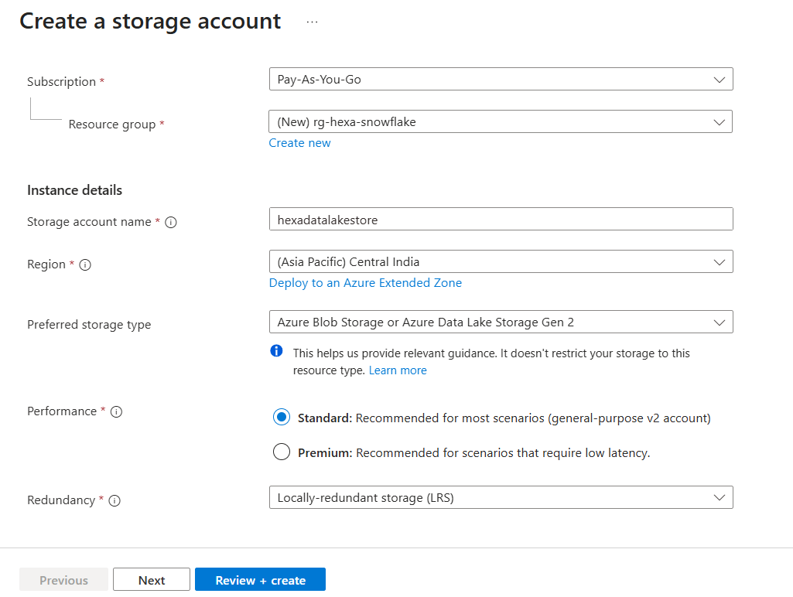
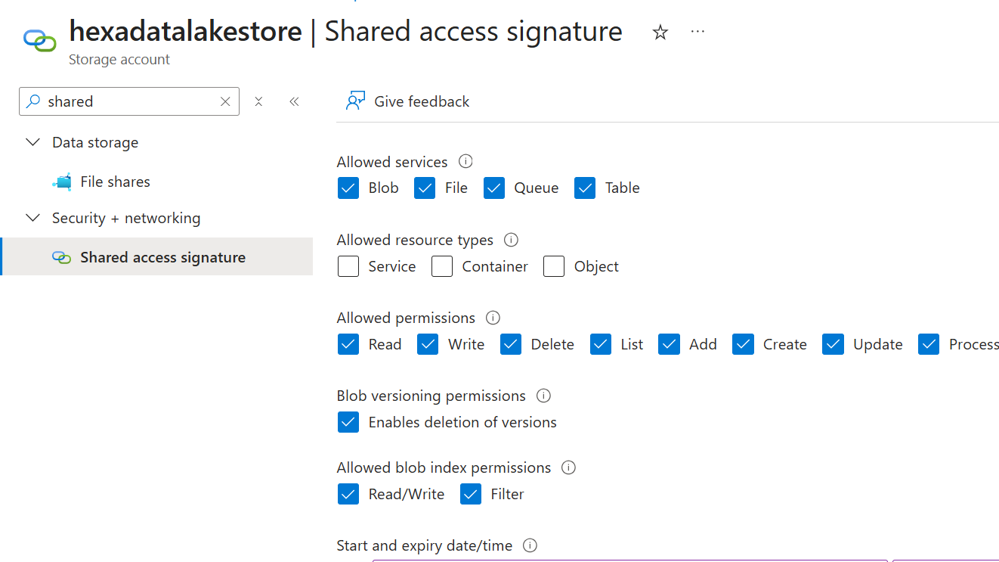
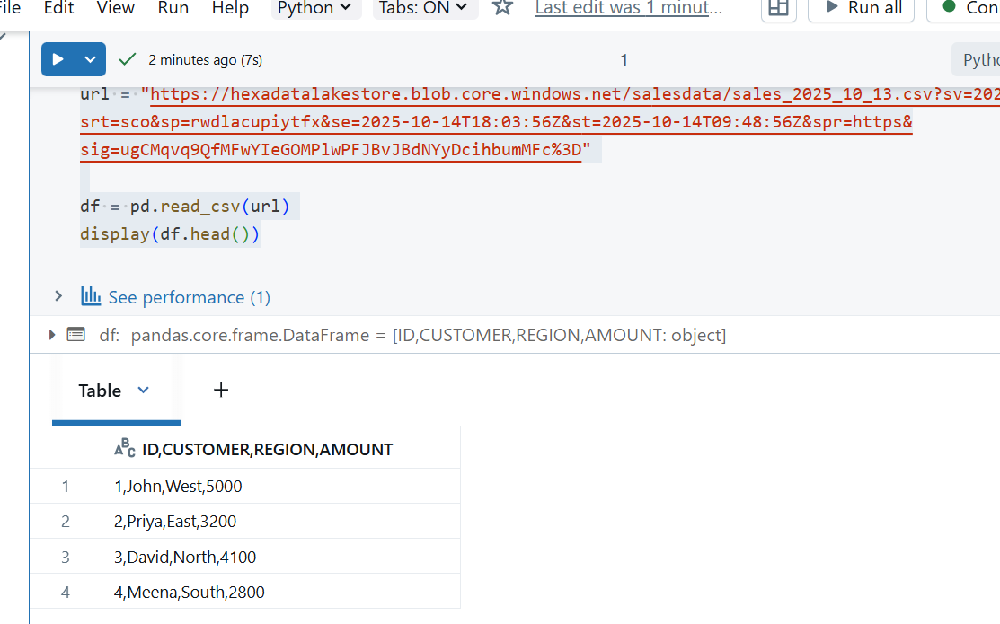
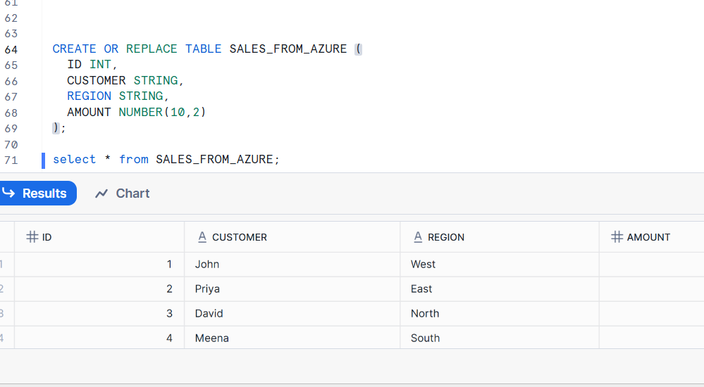

# ☁️ Snowflake + Azure + Databricks Community Edition – Step-by-Step Guide

> 🎯 **Goal:**  
Set up Snowflake and Azure Data Lake, connect them with the *free Databricks Community Edition*, move data from Azure → Databricks → Snowflake, and query Snowflake using the Snowflake Connector and Snowpark API.

---

## 🧩 1. Prerequisites

| Tool | Requirement | Notes |
|------|--------------|-------|
| **Snowflake** | Free 30-day trial | Choose Azure as cloud provider |
| **Databricks** | [Community Edition](https://community.cloud.databricks.com) | 100% free; hosted by Databricks |
| **Azure** | Free Subscription | Used for Azure Blob / Data Lake Storage |
| **Python 3.x** | Installed locally | Optional – for Snowpark script testing |

---

## ⚙️ 2. Step 1 — Create & Configure Snowflake Trial

1. Visit: [https://signup.snowflake.com](https://signup.snowflake.com)
2. Choose:
   - **Cloud provider:** Microsoft Azure  
   - **Region:** your nearest Azure region (e.g. *East US 2*)
3. Log in to **Snowsight (UI)** → You’ll get a URL like:  
   `https://xy12345.east-us-2.azure.snowflakecomputing.com`
4. Note down:
   - `Account` (e.g., `xy12345`)
   - `Username`
   - `Password`
   - `Warehouse`: `COMPUTE_WH`
   - `Database`: `MY_PRACTICE_DB`
   - `Schema`: `MY_SCHEMA`

✅ **Test your setup**
```sql
CREATE OR REPLACE TABLE SALES (
  ID INT, CUSTOMER STRING, REGION STRING, AMOUNT NUMBER(10,2)
);
INSERT INTO SALES VALUES (1, 'John', 'West', 5000);
SELECT * FROM SALES;
```

---

## 🧱 3. Step 2 — Set Up Azure Storage (ADLS / Blob)

1. In Azure Portal → **Storage Accounts → + Create**
2. Resource group → choose any
3. Storage account name → `hexadatalakestore`
4. Region → same as Snowflake region  
5. After creation → Go to **Access keys** and copy:
   - **Storage account name**
   - **Access key**
6. Under **Containers**, create:
   - Container name → `salesdata`
   - Upload CSV file → `sales_2025_10_13.csv`

✅ Example CSV:
```csv
ID,CUSTOMER,REGION,AMOUNT
1,John,West,5000
2,Priya,East,3200
3,David,North,4100
4,Meena,South,2800
```

---

## 💻 4. Step 3 — Launch Databricks Community Edition

1. Go to [https://community.cloud.databricks.com](https://community.cloud.databricks.com)
2. Sign in with any email.
3. Click **Compute → Create Cluster**
   - Name: `CommunityCluster`
   - Runtime: `11.x (includes Apache Spark 3.x, Scala 2.12)`
4. Wait until it shows **Running (green dot)** ✅

---

## 🔗 5. Step 4 — Access Azure Blob Storage from Databricks CE

> ⚠️ *Community Edition doesn’t allow dbutils.fs.mount(), but you can access via wasbs://*

### Configure Access Key
```python
import pandas as pd

url = (
    "https://hexadatalakestore.blob.core.windows.net/"
    "salesdata/sales_2025_10_13.csv"
    "?sv=2024-11-04&ss=bfqt&srt=sco&sp=rwdlacupiytfx"
    "&se=2025-10-14T18:52:49Z&st=2025-10-14T10:37:49Z"
    "&spr=https&sig=8hWQU%2BEtYbKnHXwp%2Bdt1wOAFrmBtIqzZRy41BWRbCQE%3D"
)

df = pd.read_csv(url)
print(df.head())

```



✅ You’ll see your Azure file loaded into Databricks.

---

## ❄️ 6. Step 5 — Connect Databricks to Snowflake

```python
%pip install snowflake-connector-python[pandas]

```

```python
 %restart_python
```
### Define connection options
```python
import snowflake.connector
from snowflake.connector.pandas_tools import write_pandas
import pandas as pd

url = (
    "https://hexadatalakestore.blob.core.windows.net/"
    "salesdata/sales_2025_10_13.csv"
    "?sv=2024-11-04&ss=bfqt&srt=sco&sp=rwdlacupiytfx"
    "&se=2025-10-14T18:52:49Z&st=2025-10-14T10:37:49Z"
    "&spr=https&sig=8hWQU%2BEtYbKnHXwp%2Bdt1wOAFrmBtIqzZRy41BWRbCQE%3D"
)

df = pd.read_csv(url, sep=",", encoding="utf-8-sig")
#df.columns = ["ID", "CUSTOMER", "REGION", "AMOUNT"]
#df["ID"] = df["ID"].astype(int)
#df["AMOUNT"] = df["AMOUNT"].astype(float)

conn = snowflake.connector.connect(
    user="GEETHA",
    password="MySnowflakecred1",
    account="YGVSEGU-JE02852",
    warehouse="COMPUTE_WH",
    database="MY_PRACTICE_DB",
    schema="MY_SCHEMA"
)

success, nchunks, nrows, _ = write_pandas(conn, df, "SALES_FROM_AZURE")
print(f"✅ Uploaded {nrows} rows successfully!")
conn.close()

```



## 👥 7. Step 6 — Create Role and Privileges (Optional)

In Snowflake:
```sql
CREATE ROLE DATABRICKS_ROLE;
GRANT USAGE ON WAREHOUSE COMPUTE_WH TO ROLE DATABRICKS_ROLE;
GRANT USAGE ON DATABASE TRAINING_DB TO ROLE DATABRICKS_ROLE;
GRANT USAGE ON SCHEMA PUBLIC TO ROLE DATABRICKS_ROLE;
GRANT SELECT, INSERT ON ALL TABLES IN SCHEMA PUBLIC TO ROLE DATABRICKS_ROLE;
GRANT ROLE DATABRICKS_ROLE TO USER TRAINER_USER;
```

✅ Use this role in Databricks under `sfRole`.

---

## 🏪 8. Step 7 — Explore Snowflake Marketplace

In Snowsight → **Data → Marketplace → Search “COVID-19” or “Weather Source”**  
→ Click **Get Data → Add to account**

Then query:
```sql
USE DATABASE COVID19_EPIDEMIOLOGICAL_DATA;
SELECT * FROM EPIDEMIOLOGY LIMIT 10;
```

---

## 🧠 9. Step 8 — Query Snowflake Using Snowpark

### Install Snowpark
```python
%pip install snowflake-snowpark-python
```

```python
%restart_python
```
### Initialize Session
```python
from snowflake.snowpark import Session
from snowflake.snowpark.functions import col

connection_params = {
    "user":"GEETHA",
    "password":"MySnowflakecred1",
    "account":"YGVSEGU-JE02852",
    "warehouse":"COMPUTE_WH",
    "database":"MY_PRACTICE_DB",
    "schema":"MY_SCHEMA"
}

session = Session.builder.configs(connection_params).create()
```

### Query
```python
df_snow = session.table("SALES_FROM_AZURE")
df_snow.filter(col("AMOUNT") > 3000).show()
```

✅ Output:
```
+----+---------+--------+--------+
| ID | CUSTOMER| REGION | AMOUNT |
+----+---------+--------+--------+
| 1  | John    | West   | 5000.0 |
| 2  | Priya   | East   | 3200.0 |
+----+---------+--------+--------+
```

---

## 📊 10. End-to-End Architecture
```
Azure Blob (ADLS)
    ↓
Databricks Community Edition (Spark / Snowpark)
    ↓
Snowflake (Warehouse + Schema + Table)
```

---

## ✅ Outcome Summary

| Task | Status |
|------|--------|
| Create Snowflake Trial | ✅ |
| Create Azure Blob Storage | ✅ |
| Read Azure file in Databricks CE | ✅ |
| Write data into Snowflake | ✅ |
| Query in Snowflake | ✅ |
| Run Snowpark Script | ✅ |

---

## 🧾 Trainer Notes
- Databricks CE runs on Databricks’ infra (not Azure VMs), but connects fine to Azure and Snowflake.
- `dbutils.fs.mount` won’t work — use direct `wasbs://` access.
- Use `ACCOUNTADMIN` role for learning to avoid permission issues.
- Drop tables post-lab to save Snowflake credits:
  ```sql
  DROP TABLE IF EXISTS SALES_FROM_AZURE;
  ```

---

**Author:** *Prepared by Snowflake & Databricks Specialist Trainer (GPT‑5)*  
**Module:** Databricks CE + Azure + Snowflake Integration  
**Audience:** Beginners & Data Engineering Learners
