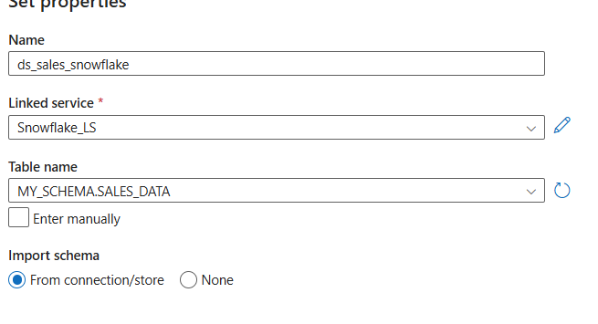

# 🧊 Data Ingestion and Transformation with Snowpark API

## 🎯 Objective
Ingest and transform data from **Azure services** into **Snowflake** using **Databricks**, **PySpark**, and **Snowpark API**.

---

## 🔹 1. What Is Data Ingestion in Snowflake?

### **Definition**
Data ingestion is the process of **loading raw data** from various sources (cloud storage, databases, APIs, etc.) into **Snowflake tables** for analysis and transformation.

### **Why It’s Needed**
- Move raw data from **Azure Data Lake, Synapse, or Databricks** into Snowflake for centralized analytics.  
- Enable **real-time or batch processing** for dashboards, ML, and reporting.  
- Support **structured** and **semi-structured** (JSON, Parquet, Avro) data.  

### **When to Use**
Use when your enterprise data resides in **Azure** but analytics and reporting run in **Snowflake**.

---

## 🔹 2. Data Ingestion Techniques in Snowflake

| Method | Description | Best Use Case |
|---------|--------------|---------------|
| **COPY INTO** | Manual bulk load from Azure Blob / Data Lake to Snowflake tables using SQL command | When you have **scheduled or ad-hoc** batch loads |
| **Snowpipe** | Continuous data loading service that automatically ingests new files as they arrive in a stage | For **real-time** or **streaming ingestion** |
| **Azure Synapse Integration** | Use Synapse pipelines or PolyBase-style integration to offload or stage data into Snowflake | When working in **hybrid Azure–Snowflake architectures** |

---

### 🧩 Example 1 — COPY INTO

```sql
-- Create a stage for Azure Blob Storage
CREATE OR REPLACE STAGE azure_stage
  url='azure://mydatalake.blob.core.windows.net/sales'
  credentials=(AZURE_SAS_TOKEN='?sv=2025-10-14...');

-- Create a table
CREATE OR REPLACE TABLE sales_data (
  order_id STRING,
  amount NUMBER,
  region STRING
);

-- Load data
COPY INTO sales_data
FROM @azure_stage/sales_oct.csv
FILE_FORMAT = (TYPE = 'CSV' FIELD_DELIMITER=',' SKIP_HEADER=1);
```

🟢 *Use when files are in Azure Blob and loaded in bulk daily or hourly.*

---

### 🧩 Example 2 — Snowpipe (Continuous Ingestion)

```sql
CREATE OR REPLACE PIPE azure_sales_pipe
AS
COPY INTO sales_data
FROM @azure_stage
FILE_FORMAT = (TYPE = 'CSV' FIELD_DELIMITER=',' SKIP_HEADER=1);
```

🟢 *Use Snowpipe when near real-time ingestion is required.*

---

## 🔹 3. Azure Data Factory (ADF) and Snowflake Integration

### **What Is It?**
ADF is Azure’s cloud-based ETL/ELT tool that can **connect to Snowflake** via ODBC or native connector to move and transform data.

### **Why Needed**
- To **orchestrate** pipelines that extract from Azure Data Lake / SQL / Synapse and **load into Snowflake**.
- Centralized **scheduling and monitoring** of data movement.

### **When to Use**
When you need a **visual ETL orchestration tool** and want to integrate multiple Azure sources with Snowflake.

## 🧩 Step-by-Step: Azure Data Factory Integration

### 🪜 Step 1 — Open Azure Data Factory

1. In **Azure Portal**, search for **Data Factories**.  
2. Select your existing ADF instance or create a new one:  
   - **Name:** `myadf-snowflake`  
   - **Region:** same as your storage account  
   - **Version:** `V2`  
3. Click **Launch Studio** (ADF UI will open in a new tab).


### 🪜 Step 2 — Create Linked Service for Azure Blob (Source)

1. In **ADF Studio** → Go to **Manage (⚙️)** → **Linked Services** → **+ New**.  
2. Search for **Azure Blob Storage**.  
3. Select it → Click **Continue**.  
4. Configure:  
   - **Name:** `AzureBlob_LS`  
   - **Authentication:** Account Key or SAS  
   - **Storage Account Name:** `hexastorageac` (your storage name)  
   - Test the connection → **Create**.

### **Example**
1. Create **Linked Service** to Snowflake.  
2. Create **Dataset** pointing to a Snowflake table.  
3. Add a **Copy Activity**:  
   - Source → Azure Blob  
   - Sink → Snowflake table  

🟢 *Use ADF for orchestrating multiple Azure pipelines.*
### 🪜 Step 3 — Create Linked Service for Snowflake (Destination)

1. Again, click **+ New** under **Linked Services**.  
2. Search for **Snowflake** → Select **Snowflake** → **Continue**.  
3. Fill details:  

| **Field** | **Example** |
|------------|-------------|
| **Name** | `Snowflake_LS` |
| **Connection Type** | `Snowflake` |
| **Account** | `hexasnowflake.east-us.azure.snowflakecomputing.com` |
| **Warehouse** | `COMPUTE_WH` |
| **Database** | `MY_PRACTICE_DB` |
| **Schema** | `PUBLIC` |
| **Authentication** | `Basic` |
| **Username** | `geetha` |
| **Password** | `MySnowflakecred1` |

4. Test Connection → **Create**.  

✅ **You’ve now connected ADF to Snowflake.**

---
### 🪜 Step 4 — Create Datasets

#### (a) Source Dataset — Azure Blob CSV

1. In **ADF Studio**, click the **Author (✏️)** icon on the left navigation pane.  
2. Under **Factory Resources**, click **+ (New)** → **Dataset**.  
3. 
4. Choose **Azure Blob Storage** → select **DelimitedText (CSV)** → click **Continue**.  
5. Fill details:  
   - **Name:** `ds_sales_blob`  
   - **Linked Service:** `AzureBlob_LS`  
   - **File path:** `salesdatacontainer/sales_data_sample.csv`  
   - Check ✅ **First row as header**.  
6. Click **OK** to save the dataset.

---

#### (b) Sink Dataset — Snowflake Table

1. Still in the **Author (✏️)** tab → click **+ (New)** → **Dataset** again.  
2. Search **Snowflake** → select it → click **Continue**.  
3. Fill details:  
   - **Name:** `ds_sales_snowflake`  
   - **Linked Service:** `Snowflake_LS`  
   - **Table:** `sales_data`  
4. Click **OK** to save.

---
## 🪜 Step 5 — Create Pipeline in ADF Studio

1. In **ADF Studio**, go to the **Author (✏️)** tab on the left panel.  
2. Under **Factory Resources**, click **+ (New)** → **Pipeline**.  
   - **Name it:** `Copy_SalesData_Snowflake`  
   - You’ve already done this ✅ (as seen in your screenshot).

---

## 🧩 Add Copy Data Activity

Now to drag the **Copy Data** activity:

1. On the **left-hand side panel**, look for the section named **Activities**.  
2. Expand **Move and transform ➜** you’ll see **Copy data** activity listed there.  
3. Click and **drag the Copy data** activity onto the central pipeline canvas (the white area in the middle).  

   💡 **Tip:** You can also double-click “Copy data” instead of dragging — it’ll auto-add to the canvas.  

4. After dropping it:  
   - Select the **Copy data** box.  
   - In the **Properties** pane (bottom or right side), rename it to something meaningful, e.g.  
     - **Name:** `Copy_Sales_Blob_to_Snowflake`
  
## ⚙️ Configure the Copy Activity

### 🔹 Source Tab
1. Click the **Source** tab (on the bottom panel).  
2. Choose **Source dataset** = `ds_sales_blob`.  
3. You can **Preview data** to confirm it’s reading your Azure Blob file correctly.  

---

### 🔹 Sink Tab
1. Click the **Sink** tab.  
2. Choose **Sink dataset** = `ds_sales_snowflake`.  
3. **Test connection** (optional).  

---

### 🔹 Mapping Tab
1. Go to **Mapping** → click **Import schema**.  
2. ADF will auto-map the source columns to your Snowflake table columns.  

---

## ▶️ Validate and Publish
1. Click **Validate all** on top (ensure no errors).


✅ You now have both **source (Azure Blob)** and **sink (Snowflake)** datasets ready for your Copy Activity pipeline.


# Example for SnowPipe with ADLS to SnowFlake

## Architecture Overview
Azure Blob Storage (container: salesdatacontainer)
       │
       │  (Event Notification)
       ▼
Azure Event Grid  ──► Snowflake Pipe (continuous copy)
       │
       ▼
Snowflake Table (auto-ingested)

## In snowflake

```sql


CREATE OR REPLACE TABLE sales_data_auto (
  order_id STRING,
  amount NUMBER,
  region STRING
);


CREATE OR REPLACE FILE FORMAT my_csv_format
  TYPE = 'CSV'
  FIELD_DELIMITER = ','
  SKIP_HEADER = 1;


CREATE OR REPLACE STAGE azure_stage_auto
  url='azure://hexastorageac.blob.core.windows.net/salesdatacontainer'
  credentials=(AZURE_SAS_TOKEN='?sv=2024-11-04&ss=b&srt=sco&sp=rl&se=2025-10-20T23:59:00Z&st=2025-10-15T08:00:00Z&spr=https&sig=XXXX')
  FILE_FORMAT = my_csv_format;

LIST @azure_stage_auto;


CREATE OR REPLACE NOTIFICATION INTEGRATION AZURE_SNOWPIPE_INT
  ENABLED = TRUE
  TYPE = QUEUE
  NOTIFICATION_PROVIDER = AZURE_EVENT_GRID
  DIRECTION = OUTBOUND
  AZURE_TENANT_ID = '51919faa-a7c3-43e9-bc7d-73c7742bc6a3'
  AZURE_EVENT_GRID_TOPIC_ENDPOINT = 'https://hexastorageac.eventgrid.azure.net/api/events'
  COMMENT = 'Integration between Azure Blob Storage and Snowflake Snowpipe';

DESC NOTIFICATION INTEGRATION AZURE_SNOWPIPE_INT;


CREATE OR REPLACE PIPE sales_data_pipe
AS
COPY INTO sales_data_auto
FROM @azure_stage_auto
FILE_FORMAT = (FORMAT_NAME = my_csv_format)
ON_ERROR = 'CONTINUE';
 
SHOW PIPES;

```

## In Azure 

## 🪜 Step 6 — Enable Azure Event Notification

To make **Snowpipe** automatic, we need to let **Azure Event Grid** notify **Snowflake** whenever a new file appears.

### In Azure Portal:


1. Open your **Storage Account **  
2. Go to **Events → + Event Subscription**.  
3. Fill details:  
   - **Name:** `snowpipe-events`  
   - **Event Type:** Blob Created (and optionally Blob Deleted)  
   - **Endpoint Type:** Web Hook  
4. **Paste the Snowflake Event Grid URL (notification channel)** here.


## 🔹 4. PySpark Transformations in Databricks for Snowflake

### **What Is It?**
Databricks uses **Apache Spark** to process and transform big data before loading it into Snowflake.

### **Why Needed**
- To perform **data cleansing, aggregation, and joins** at scale.  
- Spark is ideal for **large-volume pre-processing** before Snowflake ingestion.  

### **When to Use**
When data is in **Azure Data Lake or Delta tables** and needs transformation before Snowflake.

### **Example**

```python
# Databricks → Snowflake integration
sfOptions = {
  "sfURL": "myaccount.snowflakecomputing.com",
  "sfDatabase": "SALES_DB",
  "sfSchema": "PUBLIC",
  "sfWarehouse": "COMPUTE_WH",
  "sfRole": "SYSADMIN",
  "sfUser": "geetha",
  "sfPassword": "MyPassword"
}

df = spark.read.csv("dbfs:/mnt/bronze/sales_oct.csv", header=True)

# Transformation in PySpark
transformed_df = df.groupBy("region").agg({"amount": "sum"}).withColumnRenamed("sum(amount)", "total_sales")

# Write to Snowflake
(transformed_df.write
  .format("snowflake")
  .options(**sfOptions)
  .option("dbtable", "REGION_SALES")
  .mode("overwrite")
  .save())
```

🟢 *Use PySpark for large-scale pre-load transformations.*

---

## 🔹 5. Snowpark API for Data Transformation

### **What Is It?**
**Snowpark** is Snowflake’s **developer framework** that lets you write pipelines in **Python, Java, or Scala** directly inside Snowflake.  
Unlike PySpark, **Snowpark code executes inside Snowflake’s compute engine**, close to the data.

### **Why Needed**
- Avoids data movement — transformations happen **within Snowflake**.  
- Enables **secure, scalable, and governed** processing.  
- Integrates with **Cortex AI** and UDFs for ML/AI in Snowflake.

### **When to Use**
- You need **ELT (in-database transformation)** rather than ETL.  
- You prefer **Python-based logic** executed in Snowflake.  
- You are building **AI/ML workflows** in Snowflake.

---

### **Example: Snowpark Python Transformation**

```python
from snowflake.snowpark import Session
from snowflake.snowpark.functions import col, avg

# Connection
connection_parameters = {
  "account": "myaccount",
  "user": "geetha",
  "password": "MyPassword",
  "warehouse": "COMPUTE_WH",
  "database": "SALES_DB",
  "schema": "PUBLIC"
}
session = Session.builder.configs(connection_parameters).create()

# Load Snowflake table
sales_df = session.table("SALES_DATA")

# Transformation inside Snowflake
region_sales = (sales_df
    .group_by(col("REGION"))
    .agg(avg(col("AMOUNT")).alias("AVG_SALES"))
)

region_sales.show()
```

🟢 *Use Snowpark for in-database transformations and ML.*

---

## 🔹 6. Semi-Structured Data in Snowflake

Snowflake supports **JSON**, **Parquet**, **Avro**, and **ORC** natively without schema-on-write.

### **Why Needed**
To easily query logs, IoT, or API responses stored in Azure storage.

### **When to Use**
When ingesting **data from APIs, events, or unstructured sources**.

### **Example: Query JSON Data**

```sql
SELECT 
  raw_data:customer.id::string AS customer_id,
  raw_data:order.amount::number AS order_amount
FROM sales_json;
```

🟢 *Snowflake’s VARIANT type makes JSON querying seamless.*

---

## 🔹 7. File Formats and Stages in Snowflake

### **What Is a Stage?**
A **stage** is a storage area (internal or external) for files before loading into tables.

| Type | Example | Description |
|------|----------|-------------|
| **Internal Stage** | `@%table_name` | Managed inside Snowflake |
| **External Stage** | `@azure_stage` | Linked to Azure Blob / S3 / GCS |

### **File Formats**
Define how data files are structured for ingestion.

```sql
CREATE OR REPLACE FILE FORMAT my_csv_format
  TYPE = 'CSV'
  FIELD_DELIMITER = ','
  SKIP_HEADER = 1;
```

🟢 *Combine stages and file formats in COPY INTO or Snowpipe.*

---

## ⚙️ **End-to-End Example Flow**

**Scenario:**  
Azure Data Lake receives daily sales data (CSV, Parquet).  
You want to:
1. Use Databricks to clean and enrich the data.  
2. Load it into Snowflake using COPY INTO or Snowpipe.  
3. Perform in-database transformations using Snowpark.  
4. Expose clean data to Power BI or Cortex AI.

**Flow Diagram:**
```
Azure Data Lake → Databricks (PySpark Transform) → Snowflake Stage → COPY INTO / Snowpipe → Snowpark Transform → BI / AI
```

---

## 🧠 Summary Table

| Component | Purpose | Example Tool/Method | Execution Location |
|------------|----------|---------------------|--------------------|
| Data Ingestion | Load raw data | COPY INTO, Snowpipe, ADF | Azure → Snowflake |
| Data Transformation | Clean/enrich data | PySpark, Snowpark | Databricks / Snowflake |
| Semi-Structured Handling | Handle JSON, Parquet | VARIANT column | Snowflake |
| Orchestration | Schedule pipelines | ADF | Azure Portal |
| Query & Analytics | BI, ML | Power BI, Cortex AI | Snowflake |

✅ **Trainer Note:**  
Use this document to explain the difference between ETL vs. ELT, external vs. internal stages, and the evolution from Databricks-based Spark transformation to in-database Snowpark pipelines.

---

**End of Notes**
