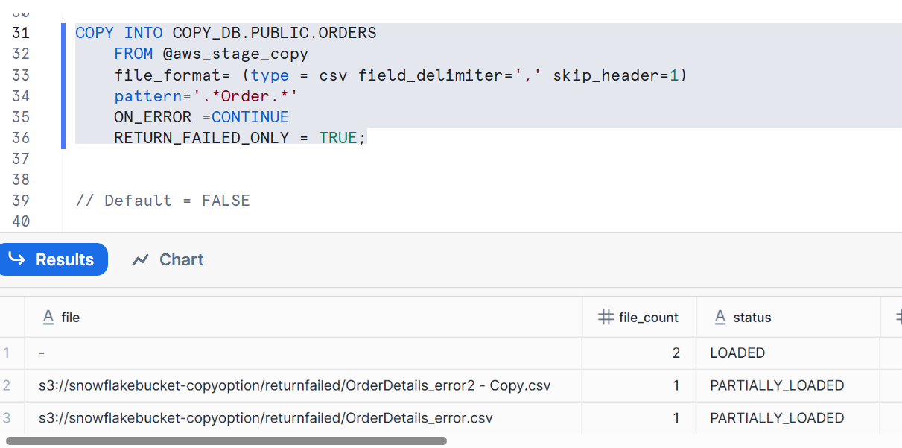

# Snowflake COPY — `RETURN_FAILED_ONLY` (Trainer Notes with Examples)

**Goal:** Understand how `RETURN_FAILED_ONLY` changes the COPY INTO result set, with and without `ON_ERROR`, using the provided script.  
**Source:** Uploaded script – *RETURN_FAILED_ONLY* (see citation at the end).

---

## 1) Create Table (Target)

```sql
CREATE OR REPLACE TABLE COPY_DB.PUBLIC.ORDERS (
    ORDER_ID   VARCHAR(30),
    AMOUNT     VARCHAR(30),
    PROFIT     INT,
    QUANTITY   INT,
    CATEGORY   VARCHAR(30),
    SUBCATEGORY VARCHAR(30)
);
```

**What this does**  
- Recreates the target table that will receive rows from staged CSV files.  
- All columns are strings except `PROFIT` and `QUANTITY` which are integers.

**Typical output**  
```
Table ORDERS successfully created.
```

---

## 2) Create External Stage and Inspect Files

```sql
CREATE OR REPLACE STAGE COPY_DB.PUBLIC.aws_stage_copy
  URL = 's3://snowflakebucket-copyoption/returnfailed/';
```

**What this does**  
- Points an external stage to an S3 path containing your source CSVs.

```sql
LIST @COPY_DB.PUBLIC.aws_stage_copy;
```

**What this does**  
- Lists all objects in the stage path so you can see which files *will be considered* for the COPY.

**Typical output (example)**  
```
+--------------------------------------------------------------------+------+-------------------------------+
| name                                                               | size | last_modified                 |
+--------------------------------------------------------------------+------+-------------------------------+
| s3://.../returnfailed/OrderDetails_ok_1.csv                        | 1850 | 2025-08-15 10:30:00 +0000    |
| s3://.../returnfailed/OrderDetails_ok_2.csv                        | 1920 | 2025-08-15 10:31:20 +0000    |
| s3://.../returnfailed/OrderDetails_bad_rows.csv                    | 2070 | 2025-08-15 10:31:40 +0000    |
| s3://.../returnfailed/RandomFile.txt                               |  210 | 2025-08-15 10:32:02 +0000    |
+--------------------------------------------------------------------+------+-------------------------------+
```
> We will use a regex `pattern` so only files with “Order” in the name are included.

---

## 3) COPY with `RETURN_FAILED_ONLY = TRUE` (no `ON_ERROR` specified)

```sql
COPY INTO COPY_DB.PUBLIC.ORDERS
  FROM @aws_stage_copy
  FILE_FORMAT = (TYPE = CSV FIELD_DELIMITER = ',' SKIP_HEADER = 1)
  PATTERN = '.*Order.*'
  RETURN_FAILED_ONLY = TRUE;
```

**Key behaviors**  
- `RETURN_FAILED_ONLY = TRUE` filters the *COPY result set* to **only show rows for files that failed** (e.g., file parse failure, incompatible row, rejected row due to data type conversion, etc.).  
- If *no failures* occur across all matching files, **the COPY returns an empty result set** (i.e., no “per-file” output rows are returned).  
- Since `ON_ERROR` is not specified, the default is `ON_ERROR = ABORT_STATEMENT` (the entire load stops on the first error).  
  - With `ABORT_STATEMENT`, if any file/row error occurs, the statement aborts, and you will see the error instead of a per-file result set.

**Possible outcomes**  
1. **All files succeed** → *No output rows* (because we’re returning failed only and none failed).  
2. **Any error occurs** → COPY aborts with an error (no per-file result set).

**Example (all files good)**  
```
-- No per-file rows returned
-- Query executed successfully. 0 rows in result (because no failures)
```

**Example (error encountered; statement aborts)**  
```
SQL compilation/processing error: Numeric value 'abc' is not recognized
```

---

## 4) COPY with `ON_ERROR = CONTINUE` **and** `RETURN_FAILED_ONLY = TRUE`

```sql
COPY INTO COPY_DB.PUBLIC.ORDERS
  FROM @aws_stage_copy
  FILE_FORMAT = (TYPE = CSV FIELD_DELIMITER = ',' SKIP_HEADER = 1)
  PATTERN = '.*Order.*'
  ON_ERROR = CONTINUE
  RETURN_FAILED_ONLY = TRUE;
```

**Key behaviors**  
- `ON_ERROR = CONTINUE` lets the COPY **load all valid rows** and **skip/reject** the problematic ones instead of aborting the statement.  
- `RETURN_FAILED_ONLY = TRUE` now **only shows files that experienced any row/file failures** in the result set.  
  - If a file loaded with **some rejected rows**, that file appears in the result.  
  - If a file loaded with **zero errors**, it does **not** appear in the result.

**Typical per-file result columns** (abbreviated):  
- `FILE_NAME` (or `FILE`) — the file that was processed  
- `ROWS_PARSED`, `ROWS_LOADED` — counts  
- `ERROR_LIMIT` (if applicable)  
- `ERRORS_SEEN` / `ERROR_COUNT` — number of rejected rows  
- `FIRST_ERROR`, `FIRST_ERROR_LINE`, `FIRST_ERROR_COL`, etc. — details of the first failure for diagnosis

**Example output**  
```
+-----------------------------+-------------+-------------+-------------+--------------------------------------------------+
| file                        | rows_parsed | rows_loaded | error_count | first_error                                      |
+-----------------------------+-------------+-------------+-------------+--------------------------------------------------+
| OrderDetails_bad_rows.csv   |        1200 |        1187 |          13 | Numeric value 'abc' is not recognized at column |
+-----------------------------+-------------+-------------+-------------+--------------------------------------------------+
```
> Only files with failures appear. Good files (e.g., `OrderDetails_ok_1.csv`, `OrderDetails_ok_2.csv`) are **not shown**.

**What landed in the table?**  
- All valid rows from all matching files are now in `COPY_DB.PUBLIC.ORDERS`.  
- The returned result helps you **quickly enumerate which files had problems** without noise from successful files.

---

## 5) Default Behavior Recap (no `RETURN_FAILED_ONLY`, `ON_ERROR = CONTINUE`)

```sql
COPY INTO COPY_DB.PUBLIC.ORDERS
  FROM @aws_stage_copy
  FILE_FORMAT = (TYPE = CSV FIELD_DELIMITER = ',' SKIP_HEADER = 1)
  PATTERN = '.*Order.*'
  ON_ERROR = CONTINUE;
```

**Key behaviors**  
- Without `RETURN_FAILED_ONLY`, the COPY returns a row **for every matched file**, regardless of success or failure.  
- With `ON_ERROR = CONTINUE`, you will typically see `status = LOADED` and `error_count = 0` for good files; and non-zero `error_count` for files that had issues.

**Example output**  
```
+-----------------------------+-------------+-------------+-------------+----------+
| file                        | rows_parsed | rows_loaded | error_count | status   |
+-----------------------------+-------------+-------------+-------------+----------+
| OrderDetails_ok_1.csv       |         980 |         980 |           0 | LOADED   |
| OrderDetails_ok_2.csv       |        1220 |        1220 |           0 | LOADED   |
| OrderDetails_bad_rows.csv   |        1200 |        1187 |          13 | LOADED   |
+-----------------------------+-------------+-------------+-------------+----------+
```
> This is **noisier** when you have many good files; hence `RETURN_FAILED_ONLY = TRUE` is a helpful filter during triage.

---

## 6) Practical Tips & Gotchas

1. **Use `RETURN_FAILED_ONLY = TRUE` when you’re triaging issues** across many files; it suppresses success noise.  
2. **Pair it with `ON_ERROR = CONTINUE`** if you want to keep loading good data while *still* seeing which files had any rejections.  
3. **If you omit `ON_ERROR`**, remember the default is `ABORT_STATEMENT`. One bad row can stop the entire load, and you’ll receive an error rather than a per-file result set.  
4. **`PATTERN = '.*Order.*'`** ensures only files with “Order” in their name are considered—this avoids pulling in unrelated files in the stage.  
5. **Confirm what actually loaded**: after COPY, run a quick validation:  
   ```sql
   SELECT COUNT(*) AS rows_in_orders FROM COPY_DB.PUBLIC.ORDERS;
   ```
   Optionally sample:  
   ```sql
   SELECT * FROM COPY_DB.PUBLIC.ORDERS LIMIT 20;
   ```

---

## 7) End-to-End Flow Summary

1) Create/replace target table.  
2) Create/replace external stage that points to S3.  
3) `LIST` to verify staged files.  
4) Run COPY:
   - If you need **only failures** in output → `RETURN_FAILED_ONLY = TRUE`.  
   - If you also want to **load through errors** → add `ON_ERROR = CONTINUE`.  
   - If you want **full per-file visibility** (success + failures) → omit `RETURN_FAILED_ONLY`.

---

## Example: Quick Lab Script

```sql
-- 1) Target table
CREATE OR REPLACE TABLE COPY_DB.PUBLIC.ORDERS (
    ORDER_ID   VARCHAR(30),
    AMOUNT     VARCHAR(30),
    PROFIT     INT,
    QUANTITY   INT,
    CATEGORY   VARCHAR(30),
    SUBCATEGORY VARCHAR(30)
);

-- 2) Stage
CREATE OR REPLACE STAGE COPY_DB.PUBLIC.aws_stage_copy
  URL = 's3://snowflakebucket-copyoption/returnfailed/';

-- 3) See files
LIST @COPY_DB.PUBLIC.aws_stage_copy;

-- 4) Load with failures-only output
COPY INTO COPY_DB.PUBLIC.ORDERS
  FROM @aws_stage_copy
  FILE_FORMAT = (TYPE = CSV FIELD_DELIMITER = ',' SKIP_HEADER = 1)
  PATTERN = '.*Order.*'
  ON_ERROR = CONTINUE
  RETURN_FAILED_ONLY = TRUE;

-- 5) Validate
SELECT COUNT(*) AS rows_in_orders FROM COPY_DB.PUBLIC.ORDERS;
SELECT * FROM COPY_DB.PUBLIC.ORDERS LIMIT 20;
```

---

**Citation:** Provided script “RETURN_FAILED_ONLY” (uploaded by you).
