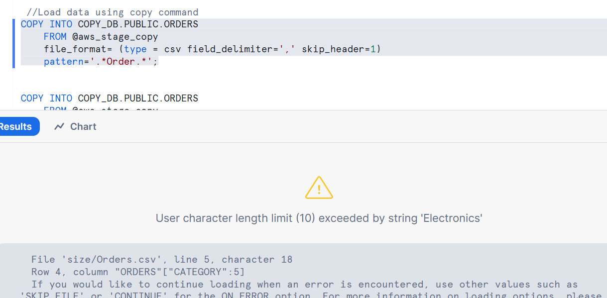
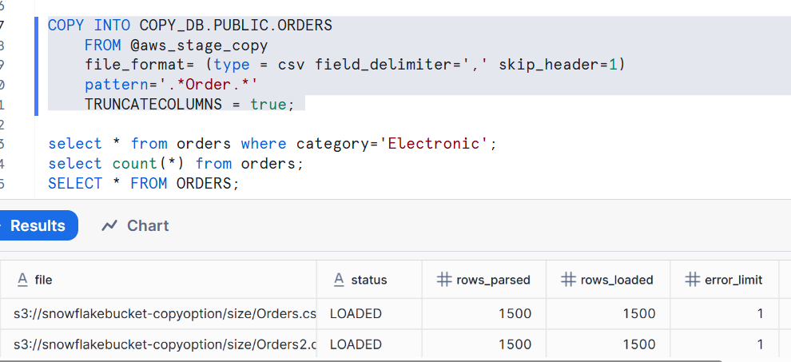
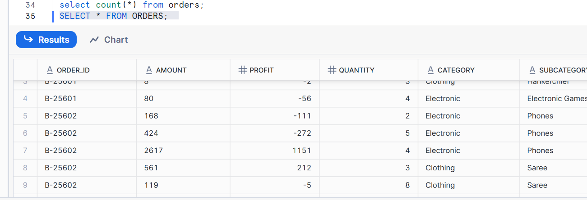

# Snowflake COPY — `TRUNCATECOLUMNS` (Trainer Notes with Explanations & Outputs)

**What you’ll learn:** How `TRUNCATECOLUMNS` affects data loading when incoming text values exceed the target column length.

> Source script: “TRUNCATECOLUMNS” (uploaded by you).

---

## 1) Create the Target Table

```sql
CREATE OR REPLACE TABLE COPY_DB.PUBLIC.ORDERS (
    ORDER_ID    VARCHAR(30),
    AMOUNT      VARCHAR(30),
    PROFIT      INT,
    QUANTITY    INT,
    CATEGORY    VARCHAR(10),   -- intentionally small to demonstrate truncation
    SUBCATEGORY VARCHAR(30)
);
```

**Explanation**  
- The `CATEGORY` column is defined as `VARCHAR(10)` on purpose so that any value longer than 10 characters (e.g., `"Office Supplies"` = 14 chars) will trigger either an error (default) or truncation (when `TRUNCATECOLUMNS=TRUE`).

**Typical output**  
```
Table ORDERS successfully created.
```

---

## 2) Create Stage & Inspect Files

```sql
CREATE OR REPLACE STAGE COPY_DB.PUBLIC.aws_stage_copy
    URL='s3://snowflakebucket-copyoption/size/';
    
LIST @COPY_DB.PUBLIC.aws_stage_copy;
```

**Explanation**  
- Creates an external stage that points to your S3 prefix where the CSV files are stored.  
- `LIST` lets you see which files Snowflake can read before your `COPY` command runs.

**Example output (illustrative)**  
```
+-----------------------------------------------------------------+------+-------------------------------+
| name                                                            | size | last_modified                 |
+-----------------------------------------------------------------+------+-------------------------------+
| s3://.../size/OrderDetails_small.csv                            | 1820 | 2025-08-15 10:30:00 +0000    |
| s3://.../size/OrderDetails_long_categories.csv                  | 2412 | 2025-08-15 10:31:40 +0000    |
+-----------------------------------------------------------------+------+-------------------------------+
```

---

## 3) COPY **without** `TRUNCATECOLUMNS`

```sql
COPY INTO COPY_DB.PUBLIC.ORDERS
  FROM @aws_stage_copy
  FILE_FORMAT = (TYPE = CSV FIELD_DELIMITER=',' SKIP_HEADER=1)
  PATTERN = '.*Order.*';
```


**Explanation**  
- Loads all `Order*` files.  
- Default `ON_ERROR` is `ABORT_STATEMENT`.  
- If any row has a text value longer than the target column length (e.g., `CATEGORY` > 10 chars), the statement **aborts** with an error and **no rows** are loaded from that file (and possibly the entire batch).

**Example outcome (if a long value is encountered)**  
```
Numeric value '...' is not recognized  -- (example for type errors)
String 'Office Supplies' is too long and would be truncated
  (length 14 exceeds max 10) at column CATEGORY
Statement aborted due to error (ON_ERROR=ABORT_STATEMENT).
```

> If **all** values fit within the defined lengths, the COPY will succeed and return per-file rows like `status=LOADED`, `rows_loaded`, etc.

**Example success output (if no length violations)**  
```
+-------------------------------+-------------+-------------+-------------+----------+
| file                          | rows_parsed | rows_loaded | error_count | status   |
+-------------------------------+-------------+-------------+-------------+----------+
| OrderDetails_small.csv        |         980 |         980 |           0 | LOADED   |
+-------------------------------+-------------+-------------+-------------+----------+
```

---

## 4) COPY **with** `TRUNCATECOLUMNS = TRUE`

```sql
COPY INTO COPY_DB.PUBLIC.ORDERS
  FROM @aws_stage_copy
  FILE_FORMAT = (TYPE = CSV FIELD_DELIMITER=',' SKIP_HEADER=1)
  PATTERN = '.*Order.*'
  TRUNCATECOLUMNS = TRUE;
```


**Explanation**  
- When a string column in the file is **longer** than the target column length, Snowflake will **truncate** the value to fit the column instead of raising an error.  
- This allows the load to **succeed** even when data contains longer text.  
- Truncated values are **loaded** (the excess characters are discarded).

**Example per-file success output**  
```
+-------------------------------------+-------------+-------------+-------------+----------+
| file                                | rows_parsed | rows_loaded | error_count | status   |
+-------------------------------------+-------------+-------------+-------------+----------+
| OrderDetails_small.csv              |         980 |         980 |           0 | LOADED   |
| OrderDetails_long_categories.csv    |        1200 |        1200 |           0 | LOADED   |
+-------------------------------------+-------------+-------------+-------------+----------+
```

> Note: Truncation itself isn’t counted as an error when `TRUNCATECOLUMNS=TRUE`, so `error_count` remains `0`.  
> If you want to record or check for possible truncations, consider loading into a **staging table** with **wide VARCHARs** (or default `VARCHAR`) first, then enforce lengths with a controlled transform, or add data-quality checks.

---

## 5) Verify the Loaded Data

```sql
SELECT * FROM COPY_DB.PUBLIC.ORDERS;
```

**What you’ll see (illustrative sample)**  

| ORDER_ID | AMOUNT | PROFIT | QUANTITY | CATEGORY     | SUBCATEGORY        |
|---------:|-------:|-------:|---------:|--------------|--------------------|
| 10001    | 120.50 | 20     | 2        | Technology   | Laptops            |
| 10002    | 65.00  | 12     | 1        | Office Sup   | Binders & Storage  |
| 10003    | 45.00  | 8      | 3        | Furniture    | Chairs             |

- The second row’s `CATEGORY` value **“Office Supplies”** was **truncated to “Office Sup”** to fit `VARCHAR(10)`.
- All other fields loaded as-is since they met the constraints.

---

## 6) When to Use (and Avoid) `TRUNCATECOLUMNS`

**Use it when:**  
- You prefer successful loads over strict enforcement and can tolerate silent truncation for occasional long values.  
- You want to quickly ingest heterogeneous files with inconsistent text lengths.

**Avoid it when:**  
- You must **preserve full text** or **guarantee no silent data loss**. In such cases, either:  
  - Increase the target column length (e.g., `CATEGORY VARCHAR(50)` or default `VARCHAR`), or  
  - Load into a **landing table** with large `VARCHAR` and then **validate/transform** with explicit rules.

**Related options**  
- `ON_ERROR = CONTINUE` to skip bad rows but load good ones (does **not** fix length overflows unless `TRUNCATECOLUMNS=TRUE`).  
- `VALIDATION_MODE` and `RETURN_FAILED_ONLY` for triaging errors without loading.  
- `SIZE_LIMIT` to control which files are loaded by size (not directly related to truncation, but often used in bulk loads).

---

## 7) Quick Validation Queries

```sql
-- Row count after load
SELECT COUNT(*) AS row_count FROM COPY_DB.PUBLIC.ORDERS;

-- Spot-check long categories (if you know typical long words like 'Office Supplies')
SELECT *
FROM COPY_DB.PUBLIC.ORDERS
WHERE LENGTH(CATEGORY) = 10   -- boundary check: exactly the max
LIMIT 20;
```

---

## 8) Summary

- **Default COPY without `TRUNCATECOLUMNS`**: overly long strings cause errors and may **abort** the load (`ON_ERROR=ABORT_STATEMENT` by default).  
- **COPY with `TRUNCATECOLUMNS=TRUE`**: silently **truncates** text to fit and **loads successfully**.  
- Choose based on data-quality needs: strict enforcement vs. operational throughput.

---

**End of trainer notes.**
