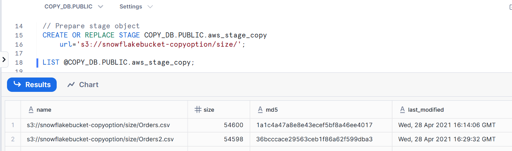
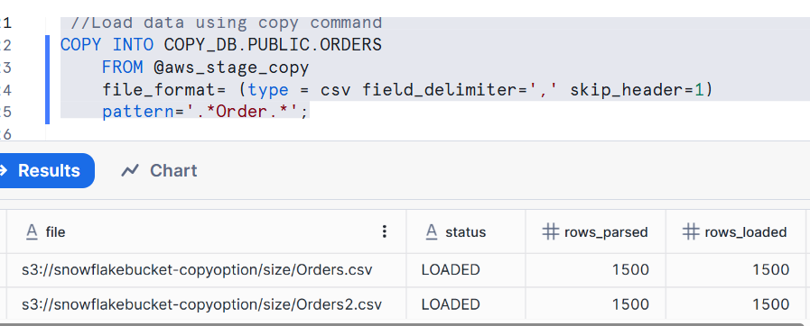
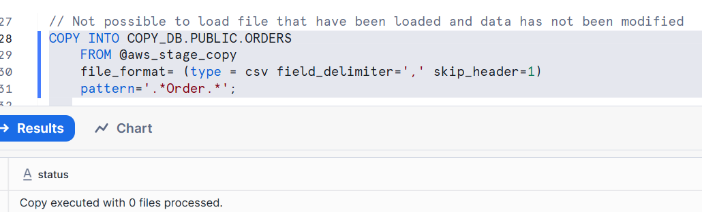
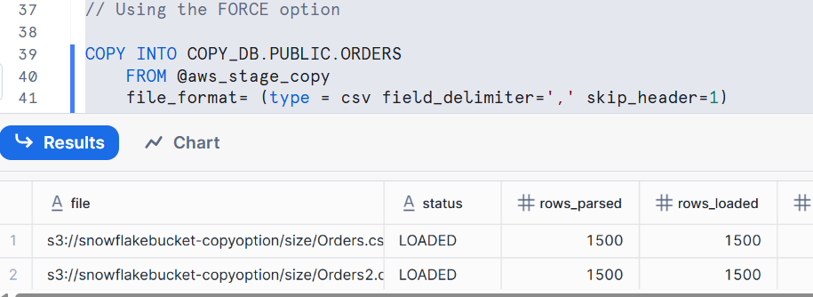
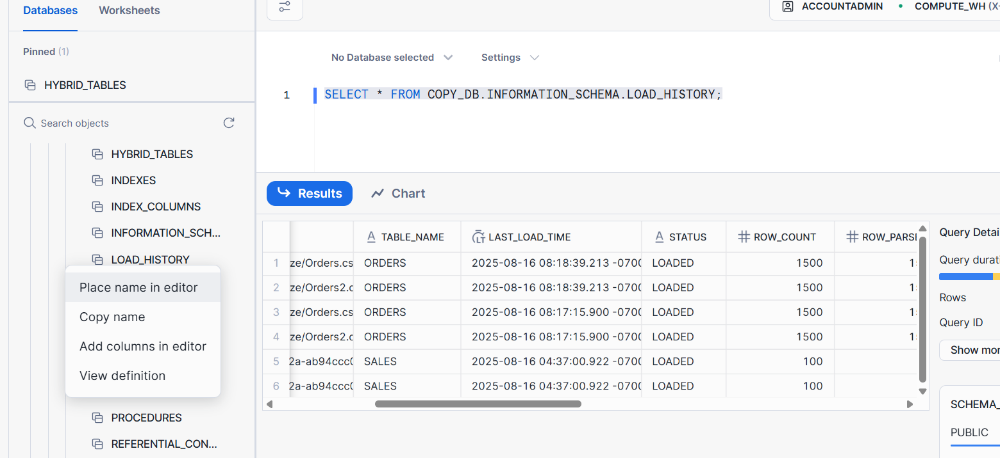
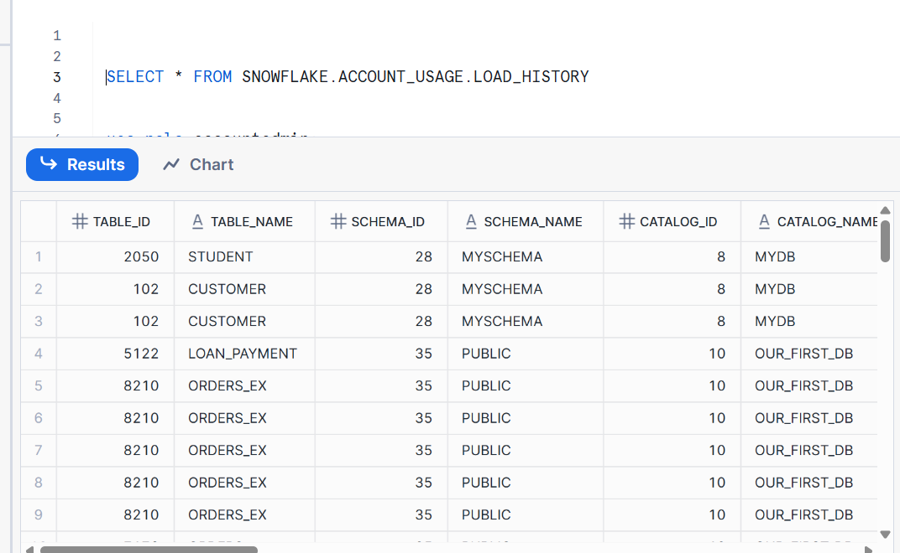
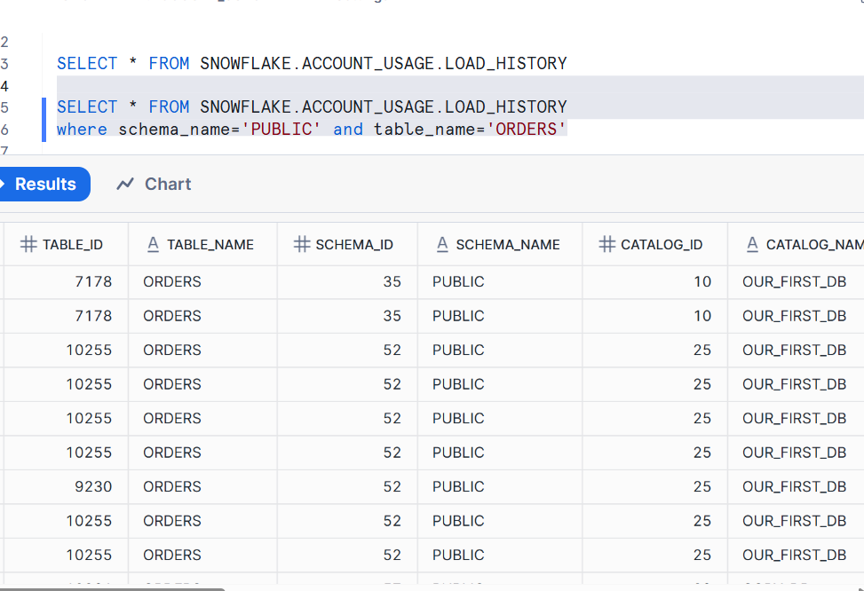
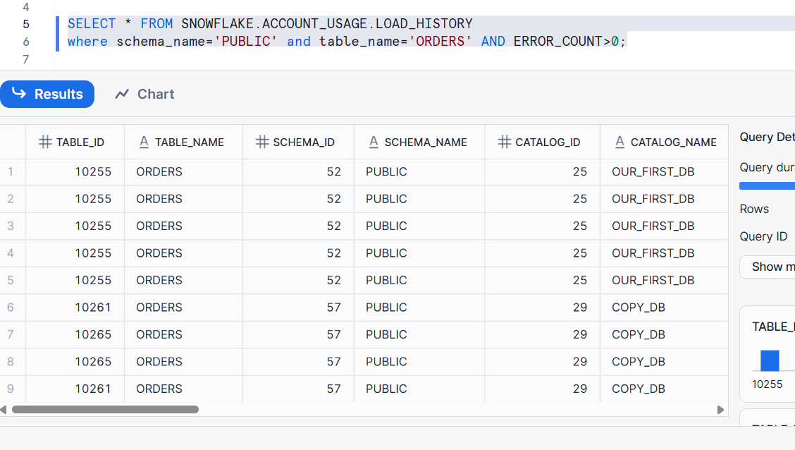
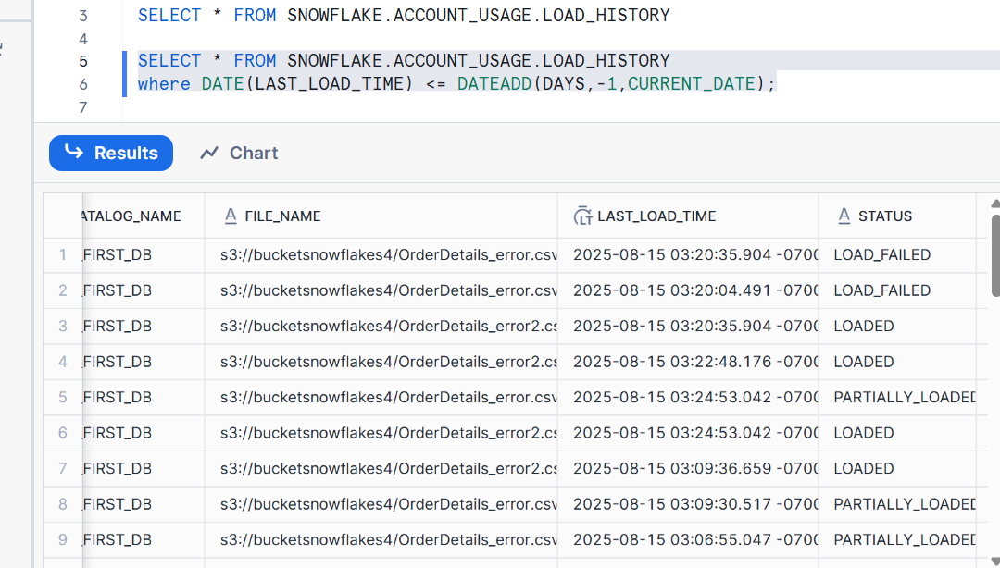

#  COPY INOT with Force
```sql
---- FORCE ----
CREATE OR REPLACE TABLE  COPY_DB.PUBLIC.ORDERS (
    ORDER_ID VARCHAR(30),
    AMOUNT VARCHAR(30),
    PROFIT INT,
    QUANTITY INT,
    CATEGORY VARCHAR(30),
    SUBCATEGORY VARCHAR(30));

// Prepare stage object
CREATE OR REPLACE STAGE COPY_DB.PUBLIC.aws_stage_copy
    url='s3://snowflakebucket-copyoption/size/';
  
LIST @COPY_DB.PUBLIC.aws_stage_copy;
```


```sql 
 //Load data using copy command
COPY INTO COPY_DB.PUBLIC.ORDERS
    FROM @aws_stage_copy
    file_format= (type = csv field_delimiter=',' skip_header=1)
    pattern='.*Order.*';
```

### 🔹 Explanation

- This loads CSV files matching the regex pattern `(.*Order.*)` into `ORDERS`.
- Snowflake **tracks file metadata** (filename + checksum) so the same file is **not reloaded** unless content changes.

   


### Explanation

Since the same files were already loaded and unchanged, Snowflake skips them.
`COPY` command returns no rows loaded.

`SELECT * FROM ORDERS;`    

```sql
// Using the FORCE option

COPY INTO COPY_DB.PUBLIC.ORDERS
    FROM @aws_stage_copy
    file_format= (type = csv field_delimiter=',' skip_header=1)
    pattern='.*Order.*'
    FORCE = TRUE;
``` 


### 🔹 Explanation

- By default, Snowflake avoids reloading unchanged files.  
- With `FORCE=TRUE`, Snowflake **ignores file load history** and reloads all matched files into the table.  
- This is useful for:
  - Reprocessing data for testing/debugging  
  - Reloading into a fresh/rebuilt table  
  - When you want duplicates on purpose (audit scenarios)  


## LOAD_HISTORY

-- Query load history within a database --

`USE COPY_DB;

SELECT * FROM information_schema.load_history;`



`SELECT * FROM SNOWFLAKE.ACCOUNT_USAGE.LOAD_HISTORY`



table_id usually not visible.
but in the above image table_id visible and it is global id. table_id is globally unique.

`SELECT * FROM SNOWFLAKE.ACCOUNT_USAGE.LOAD_HISTORY
where schema_name='PUBLIC' and table_name='ORDERS'`


```SQL
SELECT * FROM SNOWFLAKE.ACCOUNT_USAGE.LOAD_HISTORY
where schema_name='PUBLIC' and table_name='ORDERS' AND ERROR_COUNT>0;
```



```SQL

```
