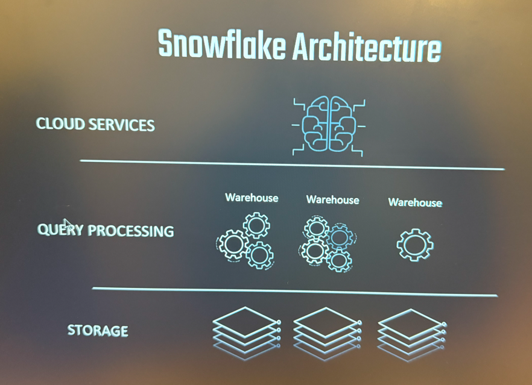
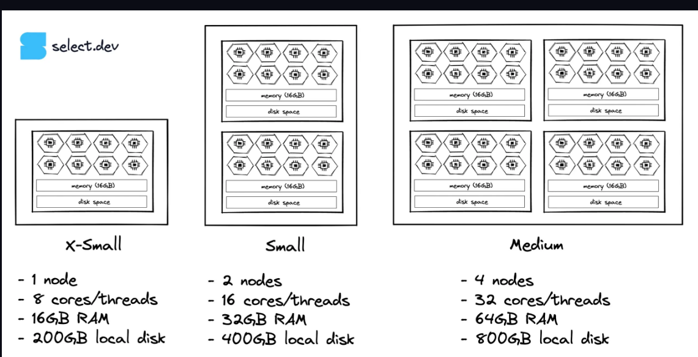
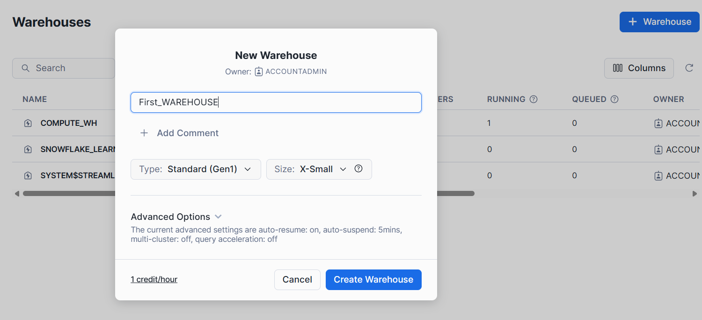
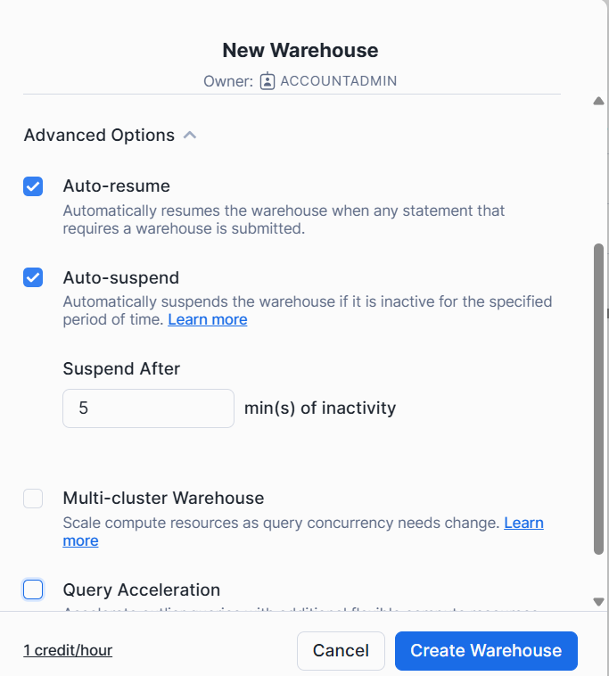

# Snow Flake Architecture

Storage layer
Hybrid columnar Storage-saved in blobs instead of rows

Query Processing Layer

Muscle of the system
Perform MMP(Massive Parallel Processing)
Compute capacity


Cloud Services Layer
Brain of the system
Managing infrastructure,Access control,Security,optimizer,Metadata etc.


Warehouse sizes

XS 1        s 2       M 4       L 8

XL 16   ...   4XL 128



Multi Clustering
                -> Server server
More Queries   -> server server
                -> Server


# What is wareHouse ?

advanced options


## How to create a warehouse using Sql Command

project -> worksheet

# Create Warehouse in Snowflake

## Basic Syntax
```sql
CREATE WAREHOUSE my_warehouse
WITH
  WAREHOUSE_SIZE = 'XSMALL'
  WAREHOUSE_TYPE = 'STANDARD'
  AUTO_SUSPEND = 300
  AUTO_RESUME = TRUE
  INITIALLY_SUSPENDED = TRUE;
  COMMENT='This is Second Warehouse'
```
| Parameter                 | Description                                                                                      |
| ------------------------- | ------------------------------------------------------------------------------------------------ |
| **`WAREHOUSE_SIZE`**      | Size of the warehouse (`XSMALL`, `SMALL`, `MEDIUM`, `LARGE`, `XLARGE`, etc.).                    |
| **`WAREHOUSE_TYPE`**      | `STANDARD` (default) or `SNOWPARK-OPTIMIZED` for Snowpark workloads.                             |
| **`AUTO_SUSPEND`**        | Time in seconds of inactivity before warehouse suspends automatically (e.g., `300` = 5 minutes). |
| **`AUTO_RESUME`**         | Automatically resumes when a query is run.                                                       |
| **`INITIALLY_SUSPENDED`** | Start warehouse in suspended state after creation.                                               |

## 3. Example Command
```sql
CREATE WAREHOUSE sales_wh
WITH
  WAREHOUSE_SIZE = 'SMALL'
  AUTO_SUSPEND = 120
  AUTO_RESUME = TRUE
  INITIALLY_SUSPENDED = TRUE;
  ```
## 4. Create Only if Not Exists
   
```sql

CREATE WAREHOUSE IF NOT EXISTS sales_wh
WITH
  WAREHOUSE_SIZE = 'SMALL'
  AUTO_SUSPEND = 120
  AUTO_RESUME = TRUE
  INITIALLY_SUSPENDED = TRUE;
1. Check Existing Warehouses
```
SHOW WAREHOUSES;
```

# Alter Warehouse
# Snowflake: Drop Warehouse

## 1. Basic Syntax
```sql
DROP WAREHOUSE warehouse_name;
```
2. Example
```sql
DROP WAREHOUSE sales_wh;
```
This will permanently delete the warehouse sales_wh.

⚠️ Note: Dropping a warehouse does not delete data in Snowflake — it only removes the compute resource.

3. Drop Only if Exists
```sql
DROP WAREHOUSE IF EXISTS sales_wh;
```
This prevents an error if the warehouse does not exist.

4. Best Practices
Always use IF EXISTS in automation scripts.

Ensure the warehouse is not running before dropping (although Snowflake auto-suspends idle warehouses).

Check existing warehouses before dropping:

```sql
SHOW WAREHOUSES;
```
