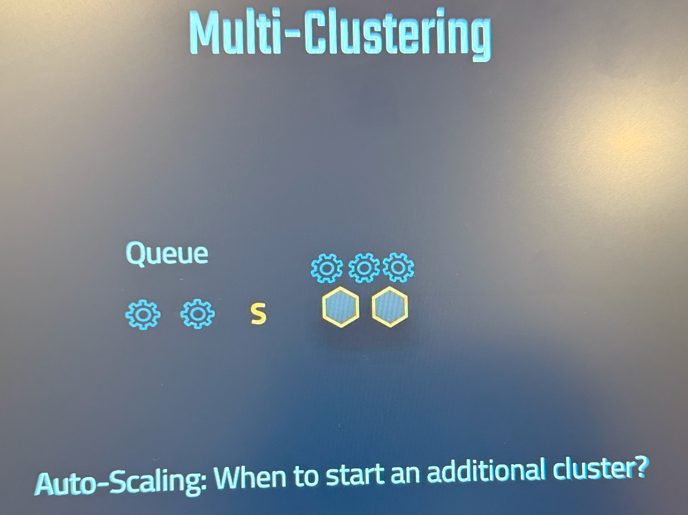

# Snowflake: Scaling Policies

Scaling policies control **how Snowflake adds or removes clusters** for a **multi-cluster warehouse** based on query load.

---

## 1. Types of Scaling Policies

| Policy Name | Description | When to Use |
|-------------|-------------|-------------|
| **STANDARD** | Default policy — Adds clusters only when needed (based on concurrent queries & queue length). Removes clusters only when they have been idle for a while. | Cost efficiency — Avoids starting clusters too quickly. |
| **ECONOMY** | More conservative scaling — Adds clusters less aggressively and keeps fewer clusters running during idle times. Reduces costs but may increase query queue times. | When cost-saving is more important than query performance. |

---

## 2. How Scaling Works
- **Applies only** to **multi-cluster warehouses**.
- Snowflake monitors:
  - **Concurrent queries**
  - **Queue length**
- When load increases:
  - New clusters start **according to scaling policy**.
- When load decreases:
  - Clusters are **automatically suspended**.

---

## 3. Syntax: Setting Scaling Policy
```sql
ALTER WAREHOUSE my_wh
SET SCALING_POLICY = 'STANDARD';
```
or
```sql
ALTER WAREHOUSE my_wh
SET SCALING_POLICY = 'ECONOMY';
```

---

## 4. Creating a Warehouse with Scaling Policy
```sql
CREATE WAREHOUSE my_multi_wh
WITH
  WAREHOUSE_SIZE = 'MEDIUM'
  WAREHOUSE_TYPE = 'STANDARD'
  AUTO_SUSPEND = 300
  AUTO_RESUME = TRUE
  MIN_CLUSTER_COUNT = 1
  MAX_CLUSTER_COUNT = 3
  SCALING_POLICY = 'ECONOMY';
```
**Explanation:**
- **`MIN_CLUSTER_COUNT`**: Minimum clusters always running.
- **`MAX_CLUSTER_COUNT`**: Maximum clusters allowed.
- **`SCALING_POLICY`**: How aggressively clusters scale up/down.

---

## 5. Real-World Examples

### Example 1: High Performance Reporting
```sql
ALTER WAREHOUSE reporting_wh
SET MIN_CLUSTER_COUNT = 2
    MAX_CLUSTER_COUNT = 6
    SCALING_POLICY = 'STANDARD';
```
- For BI dashboards with unpredictable spikes.
- Ensures faster scaling for query bursts.

### Example 2: Cost-Saving ETL Jobs
```sql
ALTER WAREHOUSE etl_wh
SET MIN_CLUSTER_COUNT = 1
    MAX_CLUSTER_COUNT = 4
    SCALING_POLICY = 'ECONOMY';
```
- For batch ETL jobs that can tolerate slight delays.
- Reduces compute cost.

---

## 6. Checking Scaling Policy
```sql
SHOW WAREHOUSES LIKE 'my_wh';
```
- Look at the **`SCALING_POLICY`** column.

---

## 7. Best Practices
- Use **`STANDARD`** for low-latency needs (dashboards, interactive queries).
- Use **`ECONOMY`** for background jobs to reduce cost.
- Combine scaling policy with **`AUTO_SUSPEND`** to save credits.
- Monitor performance using:
```sql
SELECT * FROM SNOWFLAKE.ACCOUNT_USAGE.WAREHOUSE_LOAD_HISTORY;
```
# Snowflake: Scaling Policies & Cluster Creation Behavior

Scaling policies control **how Snowflake adds or removes clusters** for a **multi-cluster warehouse** based on query load.

---

## 1. When Snowflake Creates Clusters

Scaling applies **only to multi-cluster warehouses** (i.e., `MIN_CLUSTER_COUNT` < `MAX_CLUSTER_COUNT`).

Snowflake continuously monitors:

- **Current running queries**
- **Queries in the queue**
- **Available slots** in running clusters

**Cluster creation happens when**:
1. **Concurrent query load exceeds capacity** of the currently running clusters.
2. The queue length grows beyond the allowed threshold.
3. The number of active clusters is still **less than** `MAX_CLUSTER_COUNT`.

**Cluster removal happens when**:
1. A cluster has been **idle for a period** (usually ~5–10 minutes).
2. The number of active clusters is **greater than** `MIN_CLUSTER_COUNT`.

---

## 2. Types of Scaling Policies

| Policy Name | Behavior | Effect |
|-------------|----------|--------|
| **STANDARD** | Checks load frequently and **adds clusters more quickly** when queries are queued. Waits a short grace period before removing clusters to avoid flapping. | **Better performance**, slightly higher cost. |
| **ECONOMY** | Adds clusters **less aggressively** (waits longer before scaling up) and removes idle clusters faster. | **Lower cost**, but queries might wait in the queue slightly longer. |

---

## 3. Check Frequency

- **Load checks happen approximately every 1 minute**.
- **STANDARD**:
  - Responds quickly to spikes (may add a cluster in the next 1–2 minutes after sustained queueing).
  - Removes clusters **after a few minutes** of low load.
- **ECONOMY**:
  - Waits longer before adding clusters (to avoid short-lived bursts starting extra clusters).
  - Removes idle clusters **sooner** than STANDARD (to save cost).

---

## 4. Example Timeline

**Warehouse Settings:**
```sql
MIN_CLUSTER_COUNT = 1
MAX_CLUSTER_COUNT = 3
```
Scenario:

Minute 0–1: Load spikes, queue grows →
STANDARD: Likely starts Cluster #2 quickly.
ECONOMY: Might wait to see if load subsides.

Minute 2–3: Load still high →
STANDARD: Might start Cluster #3.
ECONOMY: Possibly still on Cluster #2, starts #3 only if sustained.

After load drops:
STANDARD: Waits longer before removing clusters.
ECONOMY: Removes idle clusters quickly (within a few minutes).

5. Syntax: Setting Scaling Policy
6. ```SQL
  ALTER WAREHOUSE sales_multi_wh set  MAX_CLUSTER_COUNT=1;
```
```sql

ALTER WAREHOUSE my_wh
SET SCALING_POLICY = 'STANDARD';
```
or

```sql

ALTER WAREHOUSE my_wh
SET SCALING_POLICY = 'ECONOMY';
```
6. Creating a Warehouse with Scaling Policy
```sql

CREATE WAREHOUSE my_multi_wh
WITH
  WAREHOUSE_SIZE = 'MEDIUM'
  WAREHOUSE_TYPE = 'STANDARD'
  AUTO_SUSPEND = 300
  AUTO_RESUME = TRUE
  MIN_CLUSTER_COUNT = 1
  MAX_CLUSTER_COUNT = 3
  SCALING_POLICY = 'ECONOMY';
  ```
Explanation:

MIN_CLUSTER_COUNT: Minimum clusters always running.

MAX_CLUSTER_COUNT: Maximum clusters allowed.

SCALING_POLICY: How aggressively clusters scale up/down.

7. Real-World Examples
Example 1: High Performance Reporting
```sql

ALTER WAREHOUSE reporting_wh
SET MIN_CLUSTER_COUNT = 2
    MAX_CLUSTER_COUNT = 6
    SCALING_POLICY = 'STANDARD';
    ```
For BI dashboards with unpredictable spikes.

Ensures faster scaling for query bursts.

Example 2: Cost-Saving ETL Jobs
```sql
ALTER WAREHOUSE etl_wh
SET MIN_CLUSTER_COUNT = 1
    MAX_CLUSTER_COUNT = 4
    SCALING_POLICY = 'ECONOMY';
    ```
For batch ETL jobs that can tolerate slight delays.

Reduces compute cost.

8. Checking Scaling Policy
```sql

SHOW WAREHOUSES LIKE 'my_wh';

```
Look at the SCALING_POLICY column.

9. Best Practices
Use STANDARD for low-latency needs (dashboards, interactive queries).

Use ECONOMY for background jobs to reduce cost.

Combine scaling policy with AUTO_SUSPEND to save credits.

Monitor performance using:

```sql

SELECT * FROM SNOWFLAKE.ACCOUNT_USAGE.WAREHOUSE_LOAD_HISTORY;
```