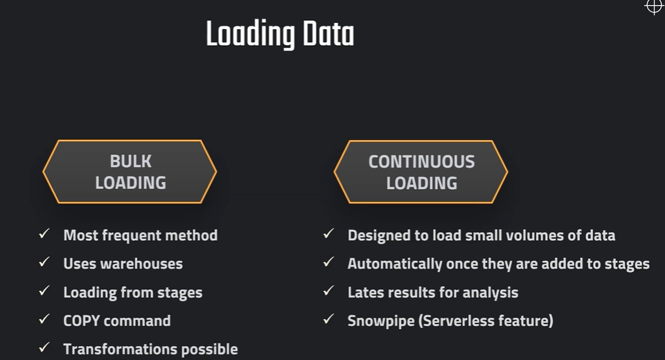
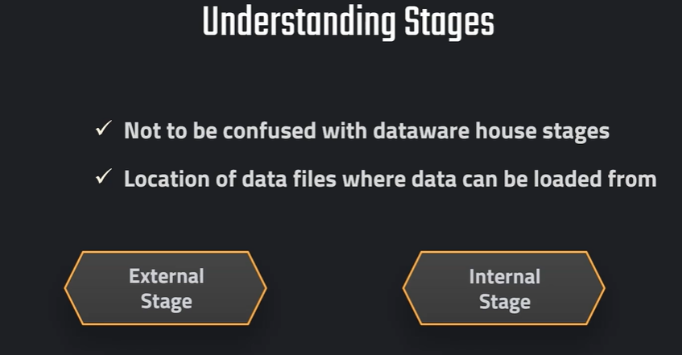
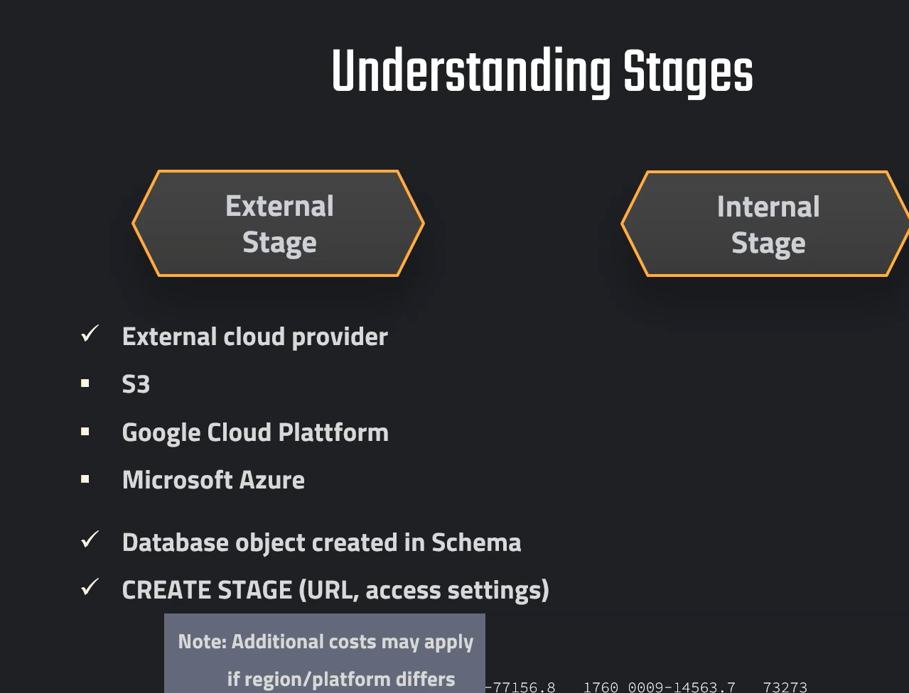
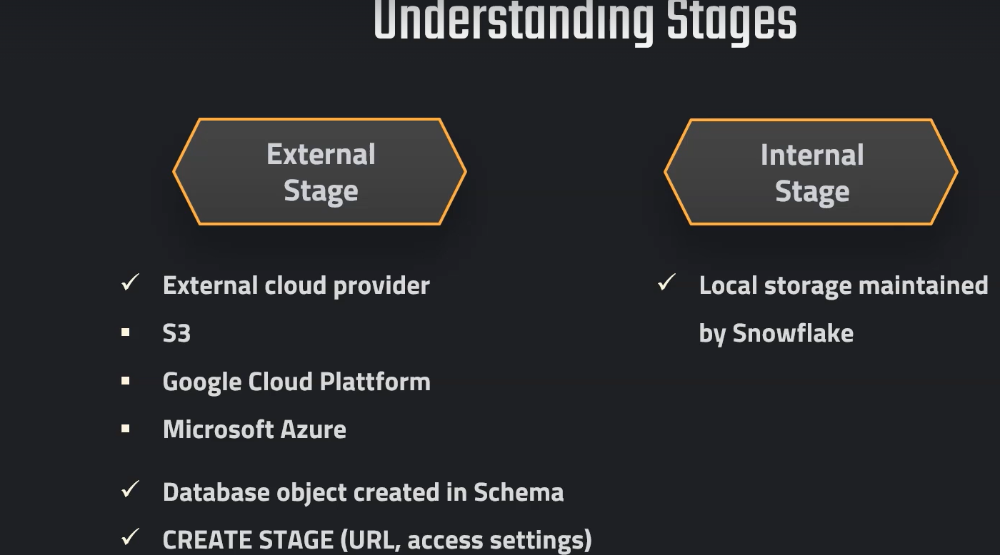

Location,credentials to load data






Add New Woeksheet ->Rename -> Create Stage

# **Loading S3 Data into Snowflake Using an External Stage — Step-by-Step Notes (Trainer Edition)**

These notes explain each statement you shared, why we use it, common pitfalls, and best practices. By the end, you’ll be able to create an S3-backed **external stage**, browse files, and load them into a table confidently.

---

## 🔧 Prerequisites & Roles
- **Warehouse running** (to execute `COPY INTO`).
- **Privileges**: `USAGE` on database & schema, `CREATE STAGE` (or ownership on schema), and `INSERT` on target table.
- **S3 Access**: Either **access keys** (IAM user) or **Storage Integration (IAM role)**. The bucket must allow `s3:ListBucket` and `s3:GetObject` for the identity you configure.
- **File format** known (CSV/JSON/Parquet) and consistent delimiter/headers.

---

## 1) Create a schema to organize external stages
```sql
CREATE OR REPLACE SCHEMA external_stages;
```
**Why:** Keeps your stages separate from application schemas, making governance and cleanup easier.

---

## 2) Create an external stage with embedded AWS keys
```sql
CREATE OR REPLACE STAGE DEMODB1.external_stages.aws_stage
  URL = 's3://bucketsnowflakes3'
  CREDENTIALS = (
    AWS_KEY_ID = 'ABCD_DUMMY_ID',
    AWS_SECRET_KEY = '1234abcd_key'
  );
```
**What it does**
- Registers `@DEMODB1.external_stages.aws_stage` pointing to your S3 bucket.
- Uses **static access keys** to authenticate.

**Trainer tips**
- Exact bucket name **must exist**; append a prefix if needed (e.g., `s3://bucket/prefix/`).
- Keys must be **active** and belong to an IAM user with at least:
  - `s3:ListBucket` on `arn:aws:s3:::bucketsnowflakes3`
  - `s3:GetObject` on `arn:aws:s3:::bucketsnowflakes3/*`
- For **temporary STS** creds, include `AWS_TOKEN` as well.

**Common error**
> *The AWS Access Key Id you provided is not valid.*  
Check typos, whitespace, whether the key is active, and that you’re not missing `AWS_TOKEN` for temporary creds.

---

## 3) Inspect stage metadata
```sql
DESC STAGE DEMODB1.external_stages.aws_stage;
```
**Why:** Verifies the URL, credentials mode (keys vs integration), and directory settings. Helps confirm that what you intended is actually stored.

---

## 4) Rotate/replace credentials
```sql
ALTER STAGE DEMODB1.external_stages.aws_stage
  SET CREDENTIALS = (AWS_KEY_ID='XYZ_DUMMY_ID' AWS_SECRET_KEY='987xyz');
```
**Why:** Rotate keys without dropping the stage.

**Notes**
- Use the **fully qualified** stage name to avoid ambiguity.
- For STS: `SET CREDENTIALS=(AWS_KEY_ID='...' AWS_SECRET_KEY='...' AWS_TOKEN='...')`.

---

## 5) Recreate the stage without credentials
```sql
CREATE OR REPLACE STAGE DEMODB1.external_stages.aws_stage
  URL = 's3://bucketsnowflakes3';
```
**Important behavior**
- `CREATE OR REPLACE` **drops and recreates** the stage.  
- If you **omit CREDENTIALS** here, the new stage now has **no embedded keys**. This will only work if:
  1) The bucket is **public** (rare/unrecommended), **or**
  2) You plan to attach a **STORAGE INTEGRATION** later, **or**
  3) You manually provide creds in each operation (not supported for `LIST`).

If you still need credentials on the stage, either:
```sql
ALTER STAGE DEMODB1.external_stages.aws_stage
  SET CREDENTIALS=(AWS_KEY_ID='...' AWS_SECRET_KEY='...');
```
**or** use a **storage integration** (recommended; see Best Practices below).

---

## 6) List files in the stage (browse)
```sql
LIST @DEMODB1.external_stages.aws_stage;
-- or, since you’re in the same DB & schema context:
LIST @aws_stage;
```
**What it does:** Fetches object names under the stage URL.  
**If you see an error:** it usually means **credentials** or **bucket policy** issues.

---

## 7) Load data from the stage into a table
```sql
COPY INTO DEMODB1.PUBLIC.ORDERS
  FROM @DEMODB1.external_stages.aws_stage
  FILE_FORMAT = (TYPE = CSV FIELD_DELIMITER = ',' SKIP_HEADER = 1)
  PATTERN = '.*Order.*';
```
**Explanation**
- `FILE_FORMAT`: Tells Snowflake how to parse files (CSV delimiter, header line).
- `PATTERN`: A regex to pick only files whose names match (e.g., `Order` files). Useful when bucket contains mixed content.
- `COPY INTO` writes rows into `PUBLIC.ORDERS` using your running warehouse.

**Validation**
- Check rows loaded and rejected files in the query result.
- Inspect the target table:
  ```sql
  SELECT COUNT(*) FROM DEMODB1.PUBLIC.ORDERS;
  SELECT * FROM DEMODB1.PUBLIC.ORDERS LIMIT 20;
  ```

**Typical parsing issues**
- Wrong delimiter or missing `FIELD_OPTIONALLY_ENCLOSED_BY` for quoted CSV ⇒ adjust file format.
- Date/number parsing mismatches ⇒ set `DATE_FORMAT`, `TIME_FORMAT`, or load to staging columns (as TEXT/VARIANT) then cast.

---

## 8) Cleanup the stage (optional)
```sql
DROP STAGE DEMODB1.external_stages.aws_stage;
```
**Why:** Remove metadata when you’re done (does **not** delete S3 content).

---

## ✅ Best Practice: Use a Storage Integration (IAM Role)
Embedding long‑lived access keys in Snowflake is discouraged. Prefer **STORAGE INTEGRATION** + **IAM role**:

1. **Create integration in Snowflake**
   ```sql
   CREATE OR REPLACE STORAGE INTEGRATION my_s3_integration
     TYPE = EXTERNAL_STAGE
     STORAGE_PROVIDER = 'S3'
     ENABLED = TRUE
     STORAGE_AWS_ROLE_ARN = 'arn:aws:iam::<acct-id>:role/<SnowflakeAccessRole>'
     STORAGE_ALLOWED_LOCATIONS = ('s3://bucketsnowflakes3/');
   DESC STORAGE INTEGRATION my_s3_integration;
   ```
   - Copy the **Snowflake AWS principal** and **external_id** from `DESC`.

2. **In AWS IAM role (trust policy)**, allow the **Snowflake principal** to assume the role with the **external_id**.

3. **Create the stage referencing the integration**
   ```sql
   CREATE OR REPLACE STAGE DEMODB1.external_stages.aws_stage
     URL='s3://bucketsnowflakes3/'
     STORAGE_INTEGRATION = my_s3_integration;
   ```

4. **Permissions on bucket**
   - Policy grants `s3:ListBucket` and `s3:GetObject` to the **role** used above.
   - Now `LIST @aws_stage;` and `COPY INTO ... FROM @aws_stage` work **without** embedding keys.

---

## 🔍 Troubleshooting Cheatsheet
- **“AWS Access Key Id you provided is not valid.”**  
  Typos, disabled key, temporary key missing `AWS_TOKEN`.
- **“Access Denied.”**  
  Bucket policy/role lacks `s3:ListBucket` or `s3:GetObject` on the path you’re listing.
- **LIST works but COPY fails**  
  File format mismatch; confirm `FILE_FORMAT` settings. Check rejected files in COPY output.
- **After CREATE OR REPLACE, stage lost credentials**  
  Re-apply `ALTER STAGE … SET CREDENTIALS=(…)` or recreate with integration.
- **Regex pattern selects nothing**  
  Verify actual object keys (`LIST @stage`) and adjust `PATTERN` accordingly.

---

## 📘 Quick Reference — CSV File Format (reusable)
```sql
CREATE OR REPLACE FILE FORMAT DEMODB1.external_stages.ff_csv
  TYPE = CSV
  FIELD_DELIMITER = ','
  SKIP_HEADER = 1
  FIELD_OPTIONALLY_ENCLOSED_BY = '"'
  NULL_IF = ('', 'NULL');
```

Then:
```sql
COPY INTO DEMODB1.PUBLIC.ORDERS
  FROM @DEMODB1.external_stages.aws_stage
  FILE_FORMAT = (FORMAT_NAME = DEMODB1.external_stages.ff_csv)
  PATTERN = '.*Order.*';
```

---

## 📌 Key Takeaways
- `CREATE OR REPLACE STAGE` **replaces** the stage; omitting `CREDENTIALS` removes stored keys.
- Prefer **Storage Integrations** over embedded keys.
- Use `DESC STAGE` and `LIST @stage` to validate setup before running `COPY INTO`.
- Always align **FILE_FORMAT** with the real structure of your files.

---
```sql
CREATE OR REPLACE TABLE DEMODB1.PUBLIC.ORDERS (
    ORDER_ID VARCHAR(30),
    AMOUNT INT,
    PROFIT INT,
    QUANTITY INT,
    CATEGORY VARCHAR(30),
    SUBCATEGORY VARCHAR(30));

    
SELECT * FROM DEMODB1.PUBLIC.ORDERS;

COPY INTO DEMODB1.PUBLIC.ORDERS FROM @aws_stage file_format= 
(type = csv field_delimiter=',' skip_header=1) pattern='.*Order.*';
```