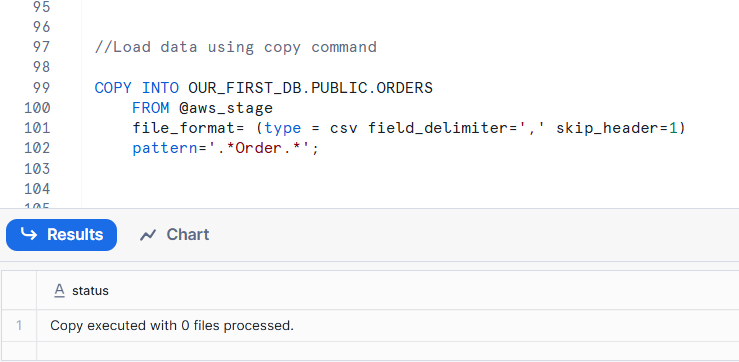

#// Creating ORDERS table
```sql
CREATE OR REPLACE TABLE OUR_FIRST_DB.PUBLIC.ORDERS (
    ORDER_ID VARCHAR(30),
    AMOUNT INT,
    PROFIT INT,
    QUANTITY INT,
    CATEGORY VARCHAR(30),
    SUBCATEGORY VARCHAR(30));
    
SELECT * FROM OUR_FIRST_DB.PUBLIC.ORDERS;
```

## First copy command
```sql
COPY INTO OUR_FIRST_DB.PUBLIC.ORDERS
    FROM @aws_stage
    file_format = (type = csv field_delimiter=',' skip_header=1);

```
## Copy command with fully qualified stage object

COPY INTO OUR_FIRST_DB.PUBLIC.ORDERS
    FROM @MANAGE_DB.external_stages.aws_stage
    file_format= (type = csv field_delimiter=',' skip_header=1);

our stage has multiple files. snowflake tries to load all the files.
The file has only 2 columns
-
## // List files contained in stage
`LIST @MANAGE_DB.external_stages.aws_stage;`   

-
## // Copy command with specified file(s)

```sql
COPY INTO OUR_FIRST_DB.PUBLIC.ORDERS
    FROM @MANAGE_DB.external_stages.aws_stage
    file_format= (type = csv field_delimiter=',' skip_header=1)
    files = ('OrderDetails.csv');
```
## // Copy command with pattern for file names
```sql
COPY INTO OUR_FIRST_DB.PUBLIC.ORDERS
    FROM @MANAGE_DB.external_stages.aws_stage
    file_format= (type = csv field_delimiter=',' skip_header=1)
    pattern='.*Order.*';
```

## // Copy command with pattern for file names
If we have Multiple files with Order1,order1. It will read all the files and copy into orders table
```sql
COPY INTO OUR_FIRST_DB.PUBLIC.ORDERS
    FROM @MANAGE_DB.external_stages.aws_stage
    file_format= (type = csv field_delimiter=',' skip_header=1)
    pattern='.*Order.*';
```
If we have Multiple files with Order1,order1. It will read all the files and copy into orders table



as in staging we have one file with orders. and we alreaded loaded that data. so it shows o files processed. It means it skip the files alreaded loaded


If you  want you can recreate the table and try the above copy into command with pattern and check
```sql
CREATE OR REPLACE TABLE OUR_FIRST_DB.PUBLIC.ORDERS (
    ORDER_ID VARCHAR(30),
    AMOUNT INT,
    PROFIT INT,
    QUANTITY INT,
    CATEGORY VARCHAR(30),
    SUBCATEGORY VARCHAR(30));
    
SELECT * FROM OUR_FIRST_DB.PUBLIC.ORDERS;
```
## //Load data using copy command
```sql
COPY INTO OUR_FIRST_DB.PUBLIC.ORDERS
    FROM @aws_stage
    file_format= (type = csv field_delimiter=',' skip_header=1)
    pattern='.*Order.*';
```
    


