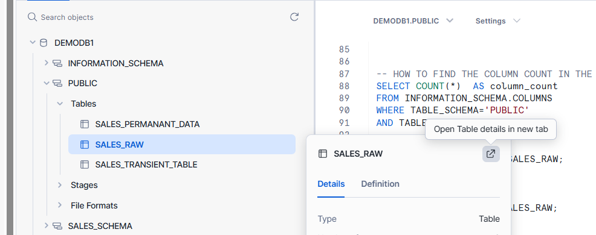
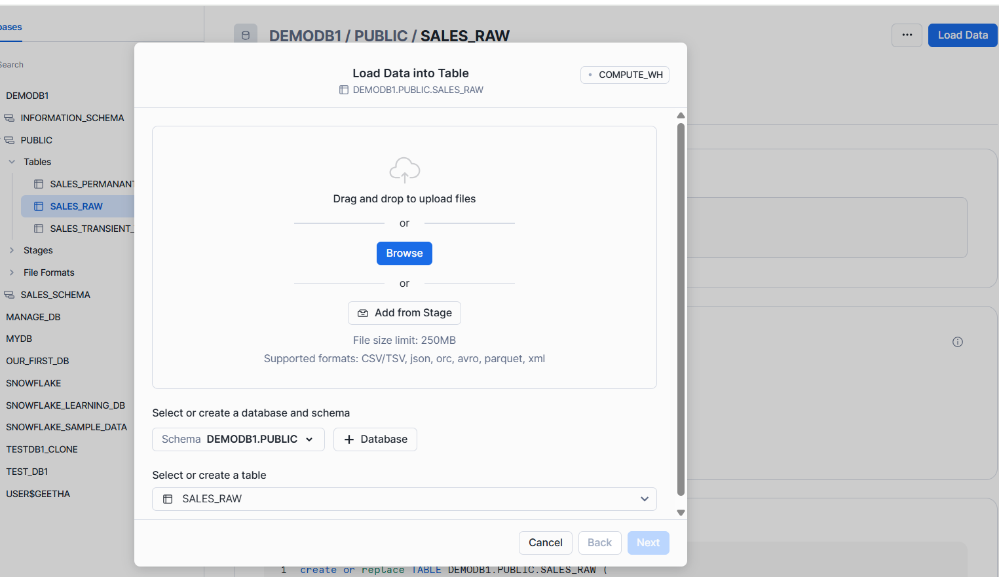
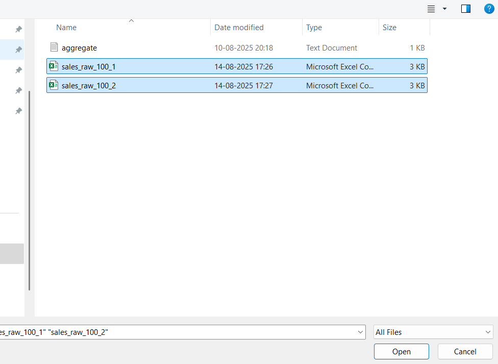
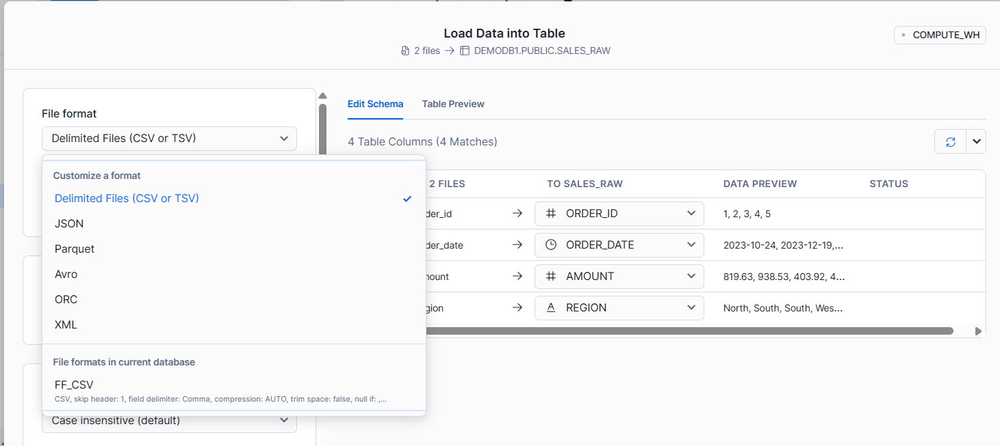
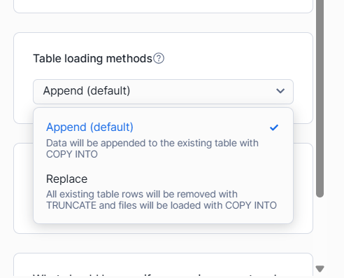
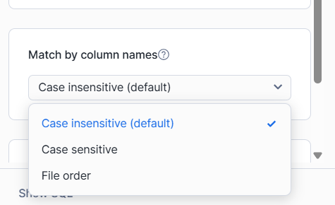
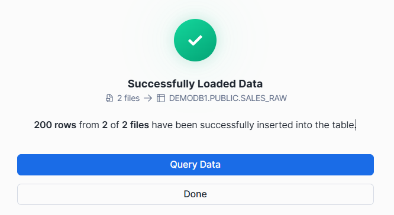

# **Loading Data into Snowflake Table Using Snowsight Without Explicit Staging**

In Snowflake **Snowsight** (Web UI), you can load a file directly into a table **without** creating a named stage.  
Behind the scenes, Snowflake uploads the file to a **temporary/user stage**, then uses a `COPY INTO` command.

---

## **1. Prerequisites**
- Active Snowflake **warehouse** (running).
- `USAGE` privilege on the database and schema.
- `INSERT` privilege on the target table.
- File ready in supported format (CSV, JSON, Parquet, etc.).

---

## **2. Step-by-Step Process in Snowsight**

### **Step 1 — Open the target table**
1. In Snowsight, navigate: **Data → Databases → Your Database → Schema → Tables**.
2. Click the table name where you want to load data.


### **Step 2 — Start the load wizard**
- Click **Load Data** (top-right of the table page).

### **Step 3 — Choose the file(s)**
- Click **Browse** or drag-and-drop your file(s).
- Multiple files are supported.

### **Step 4 — Select or create a file format**

- Choose existing **File Format** or create a new one:
    - **Type:** CSV, JSON, or Parquet
    - **For CSV:**
      - `FIELD_DELIMITER = ','`
      - `SKIP_HEADER = 1` (if file has header)
      - `FIELD_OPTIONALLY_ENCLOSED_BY = '"'`
      - `NULL_IF = ('', 'NULL')`

### **Step 5 — Map columns**
- Ensure preview matches the table's column order and data types.
- Adjust mapping if order differs.


### **Step 6 — Load options**
- **On Error:** `CONTINUE` (skip bad rows) or `ABORT_STATEMENT` (stop on first error).
- **Truncate table first:** optional for full replace.
- **Purge files after load:** removes temp copies after success.

### **Step 7 — Review SQL**
- Snowsight shows generated `COPY INTO` SQL. Confirm settings.

### **Step 8 — Execute load**
- Click **Load** and monitor job status.

### **Step 9 — Verify**
- Preview the table or run:
```sql
SELECT COUNT(*) FROM your_db.your_schema.your_table;
```

---

## **3. How It Works Internally**
- Snowsight uploads your file to a **temporary/user stage** (`@~`).
- Executes `COPY INTO` from that stage to your table.
- Deletes staged files if `PURGE = TRUE` is set.

---

## **4. Sample Generated SQL**
**For CSV:**
```sql
COPY INTO your_db.your_schema.sales_raw
  FROM @~
  FILE_FORMAT = (
    TYPE = CSV
    FIELD_DELIMITER = ','
    SKIP_HEADER = 1
    FIELD_OPTIONALLY_ENCLOSED_BY = '"'
    NULL_IF = ('', 'NULL')
  )
  ON_ERROR = 'CONTINUE'
  PURGE = TRUE;
```

**With explicit column mapping:**
```sql
COPY INTO your_db.your_schema.sales_raw (order_id, order_date, amount, region)
  FROM @~
  FILE_FORMAT = (FORMAT_NAME = my_csv_format)
  ON_ERROR = 'ABORT_STATEMENT';
```

---

## **5. Tips**
- **JSON:** use `TYPE = JSON`, and `STRIP_OUTER_ARRAY = TRUE` if the file contains an array of objects.
- **Parquet:** use `TYPE = PARQUET` — schema can be inferred.
- For large files, consider **parallel file uploads**.

---
