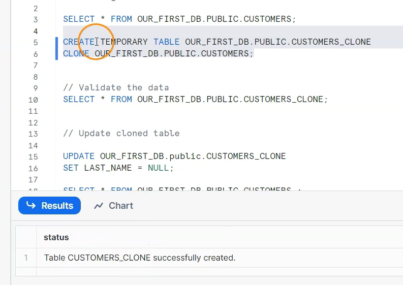

# Cloning Tables

```SQL
// Cloning

SELECT * FROM OUR_FIRST_DB.PUBLIC.CUSTOMERS;

CREATE TABLE OUR_FIRST_DB.PUBLIC.CUSTOMERS_CLONE
CLONE OUR_FIRST_DB.PUBLIC.CUSTOMERS;


// Validate the data
SELECT * FROM OUR_FIRST_DB.PUBLIC.CUSTOMERS_CLONE;


// Update cloned table

UPDATE OUR_FIRST_DB.public.CUSTOMERS_CLONE
SET LAST_NAME = NULL;

SELECT * FROM OUR_FIRST_DB.PUBLIC.CUSTOMERS ;

SELECT * FROM OUR_FIRST_DB.PUBLIC.CUSTOMERS_CLONE;


// Cloning a temporary table is not possible
CREATE OR REPLACE TEMPORARY TABLE OUR_FIRST_DB.PUBLIC.TEMP_TABLE(
  id int);

CREATE TRANSIENT TABLE OUR_FIRST_DB.PUBLIC.TABLE_COPY
CLONE OUR_FIRST_DB.PUBLIC.TEMP_TABLE;
```


```SQL
CREATE TEMPORARY TABLE OUR_FIRST_DB.PUBLIC.TABLE_COPY
CLONE OUR_FIRST_DB.PUBLIC.TEMP_TABLE;
```


```SQL
SELECT * FROM OUR_FIRST_DB.PUBLIC.TABLE_COPY;
```