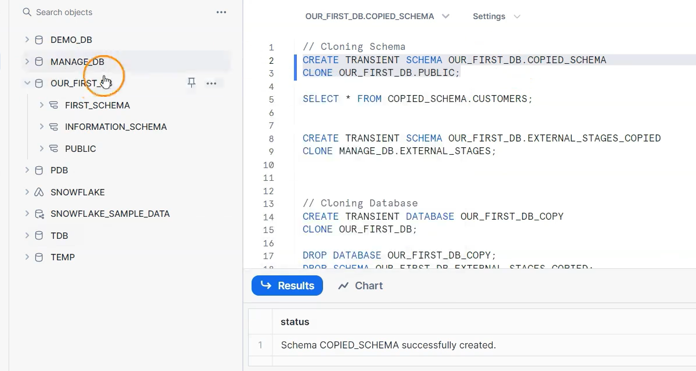
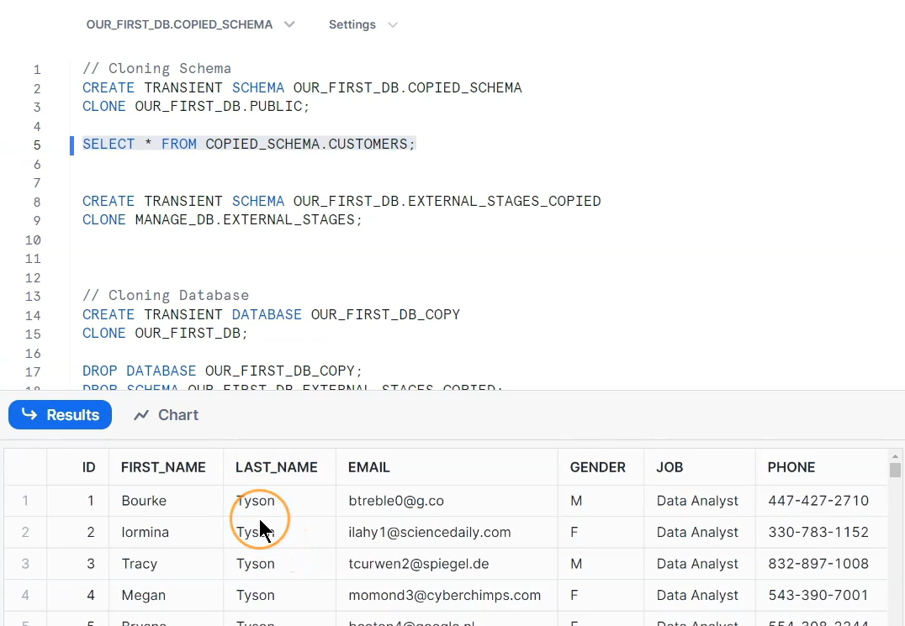
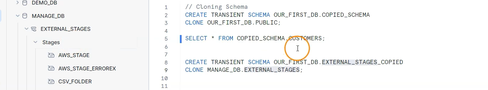
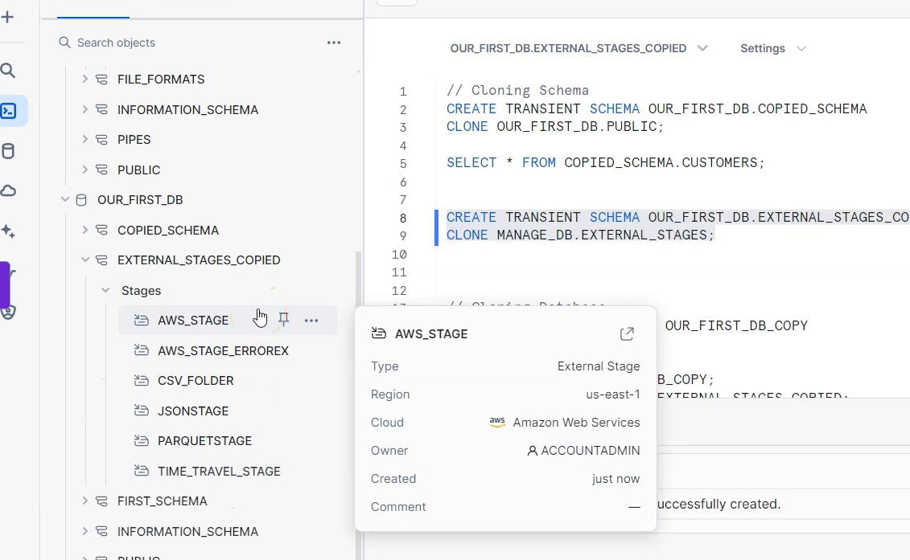
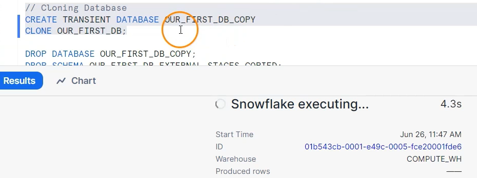
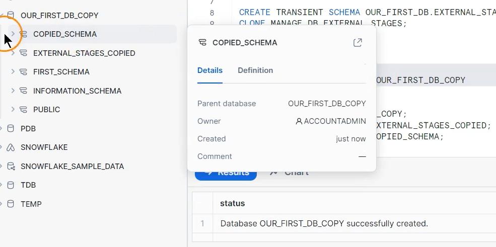

# 🧊 Snowflake — Cloning Schemas & Databases

---

## 📘 Introduction

**Zero-Copy Cloning** in Snowflake doesn’t stop at the *table* level — it also supports **schemas** and **entire databases**.

This feature allows you to create *instant*, *space-efficient*, and *independent* clones of existing **schemas** or **databases** without physically copying any data.

---

## 💡 Key Highlights

✅ **Instant schema or database duplication** — regardless of size.  
✅ **No storage overhead** — only metadata is cloned.  
✅ **Independent environments** — the cloned schema or DB can be modified safely.  
✅ **Ideal for Dev/Test environments, backups, and UAT.**

---

## 🧱 Cloning a Schema

You can clone a schema (and all objects inside it) using a simple SQL command.

```sql
CREATE TRANSIENT SCHEMA OUR_FIRST_DB.COPIED_SCHEMA
CLONE OUR_FIRST_DB.PUBLIC;
```

### 🧩 Explanation:
- `CREATE TRANSIENT SCHEMA` — creates a new **transient schema**, meaning it has **no fail-safe** but is cheaper to maintain.
- `CLONE OUR_FIRST_DB.PUBLIC` — copies all **tables, views, and objects** from the `PUBLIC` schema inside `OUR_FIRST_DB`.

---

### ✅ Validate the Cloned Schema

```sql
SELECT * FROM COPIED_SCHEMA.CUSTOMERS;
```

📊 This query confirms that the cloned schema (`COPIED_SCHEMA`) contains the same data as the source (`PUBLIC`).

---

### 🖼️ Visual Reference




> These screenshots show how schema cloning appears in the Snowflake UI and how data remains consistent between source and clone.

---

## 🧱 Cloning a Different Schema (Cross-Database Example)

You can also clone a schema from **another database** — perfect for cross-environment migration or experimentation.

```sql
CREATE TRANSIENT SCHEMA OUR_FIRST_DB.EXTERNAL_STAGES_COPIED
CLONE MANAGE_DB.EXTERNAL_STAGES;
```

### 🧩 Explanation:
- The cloned schema `EXTERNAL_STAGES_COPIED` is created inside `OUR_FIRST_DB`.
- It duplicates all objects (like external stages, file formats, etc.) from `MANAGE_DB.EXTERNAL_STAGES`.

---

### 🖼️ Visual Reference




> These images show the schema duplication process and validation of external stage data.

---

## 🧭 Cloning a Database

You can also clone an **entire database** (including all schemas, tables, and metadata).

```sql
CREATE TRANSIENT DATABASE OUR_FIRST_DB_COPY
CLONE OUR_FIRST_DB;
```

### 🧩 Explanation:
- `CREATE TRANSIENT DATABASE` creates a **transient** clone of the full database.
- `CLONE OUR_FIRST_DB` duplicates all objects inside — schemas, tables, views, file formats, and roles associated.

---

### ✅ Validate the Cloned Database
Once cloned, you can query any table in the new database exactly as in the original:

```sql
SELECT * FROM OUR_FIRST_DB_COPY.PUBLIC.CUSTOMERS;
```

---

### 🖼️ Visual Reference




> The screenshots confirm successful database cloning and independent visibility of all schemas and tables.

---

## 🧹 Cleaning Up

After testing or validation, it’s good practice to drop cloned objects to free up metadata resources.

```sql
DROP DATABASE OUR_FIRST_DB_COPY;
DROP SCHEMA OUR_FIRST_DB.EXTERNAL_STAGES_COPIED;
DROP SCHEMA OUR_FIRST_DB.COPIED_SCHEMA;
```

🧽 This ensures a clean environment after your cloning tests.

---

## 🧠 Comparison: Table vs Schema vs Database Cloning

| Clone Type | Contains | Typical Use Case | Supported? |
|-------------|-----------|------------------|-------------|
| **Table** | Rows & columns | Test data without duplication | ✅ |
| **Schema** | Multiple tables/views | UAT or partial backup | ✅ |
| **Database** | All schemas & objects | Full environment copy | ✅ |
| **Temporary Tables** | Session-only data | Short-term data | ❌ |

---

## 🧩 Real-World Use Cases

1. **Development Sandbox:**  
   Clone the production schema for testing new ETL pipelines.

2. **Data Backup:**  
   Clone the entire database before running major transformations.

3. **UAT Environments:**  
   Give QA teams cloned copies for verification without affecting production.

4. **Cross-Team Collaboration:**  
   Data science and analytics teams can use clones for model training or reporting.

---

## 🏁 Final Takeaway

> **Snowflake Zero-Copy Cloning** for schemas and databases allows you to create instant, independent, and storage-efficient environments for safe data experimentation.

It is a **game-changer** for teams needing fast, isolated copies of data for testing, analytics, and automation workflows — all **without any physical duplication**.

---

## 🖼️ Complete Visual Recap

| Stage | Screenshot |
|--------|-------------|
| Cloning Schema |  |
| Validation |  |
| Cloning External Schema |  |
| Schema Validation |  |
| Cloning Database |  |
| Database Verification |  |

---

✨ **Pro Tip:** Combine this with *Snowflake Tasks* and *Streams* to automatically refresh cloned environments for nightly testing or analytics snapshots.
