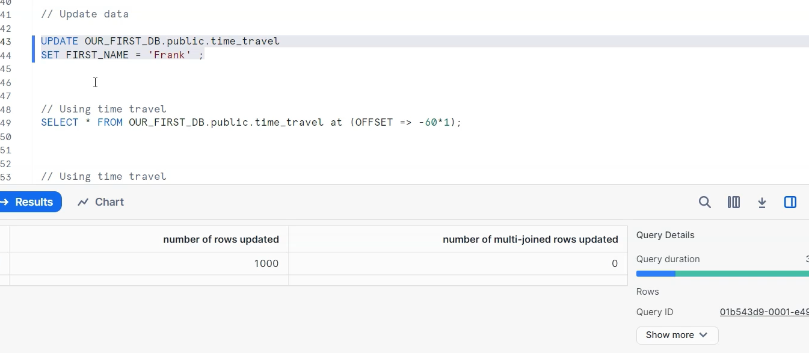
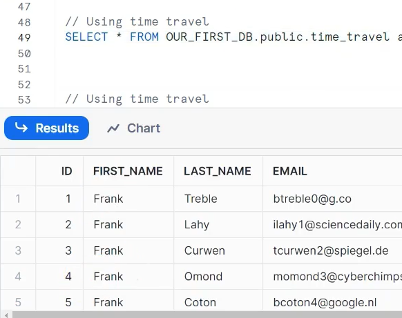
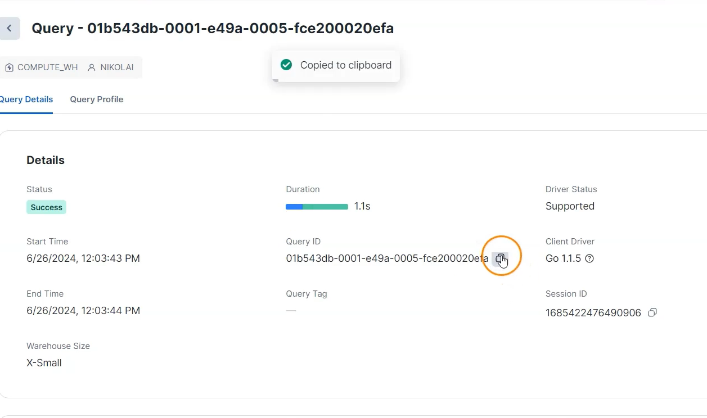
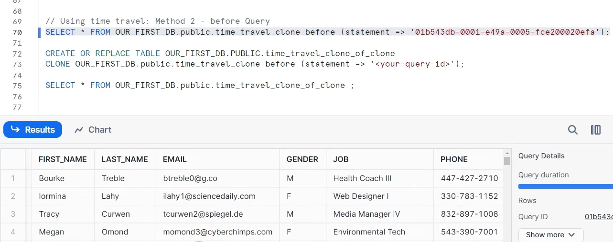

# 🧊 Snowflake — Cloning with Time Travel

---

## 📘 Introduction

**Snowflake Time Travel** allows you to **access historical data** (that is, data that has been changed or deleted) for a defined period.  
Combined with **Zero-Copy Cloning**, you can *restore, analyze, or experiment* on historical data **without impacting your live data**.

---

## 🕰️ What is Time Travel?

Time Travel enables you to query, clone, or restore data from a **previous point in time** using:

- **Offset (in seconds)** → relative time (e.g., 60 seconds ago)  
- **Timestamp** → specific date/time  
- **Statement ID** → the state of data *before* a specific query was executed  

⏳ **Default Retention Periods:**
- **Permanent tables:** 1 day (can be extended up to 90 days)
- **Transient and Temporary tables:** 0 or 1 day (configurable)

---

## 🧱 1. Setting Up the Base Table

```sql
CREATE OR REPLACE TABLE OUR_FIRST_DB.PUBLIC.time_travel (
   id INT,
   first_name STRING,
   last_name STRING,
   email STRING,
   gender STRING,
   job STRING,
   phone STRING
);
```

This table will be used to demonstrate **updates, time travel queries, and cloning**.

---

## 📂 2. Creating Supporting File Format & Stage

We first define a **CSV file format** and a **Snowflake stage** to load sample data.

```sql
CREATE OR REPLACE FILE FORMAT MANAGE_DB.file_formats.csv_file
    TYPE = CSV
    FIELD_DELIMITER = ','
    SKIP_HEADER = 1;

CREATE OR REPLACE STAGE MANAGE_DB.external_stages.time_travel_stage
    URL = 's3://data-snowflake-fundamentals/time-travel/'
    FILE_FORMAT = MANAGE_DB.file_formats.csv_file;

LIST @MANAGE_DB.external_stages.time_travel_stage;
```

> ✅ **Purpose:** This setup ensures that data can be easily loaded from an external S3 source into Snowflake.

---

## 💾 3. Loading Data into the Table

```sql
COPY INTO OUR_FIRST_DB.PUBLIC.time_travel
FROM @MANAGE_DB.external_stages.time_travel_stage
FILES = ('customers.csv');
```

Once data is loaded:

```sql
SELECT * FROM OUR_FIRST_DB.PUBLIC.time_travel;
```



---

## ⚠️ 4. An Accidental Update

Suppose we accidentally update *all* records.

```sql
UPDATE OUR_FIRST_DB.PUBLIC.time_travel
SET FIRST_NAME = 'Frank';
```


💡 **Issue:** All names have been changed to “Frank” — but don’t worry!  
We can *travel back in time* to recover the data.

---

## ⏪ 5. Using Time Travel (Method 1 — Using OFFSET)

To view data as it was **1 minute ago (60 seconds)**:

```sql
SELECT * 
FROM OUR_FIRST_DB.PUBLIC.time_travel 
AT (OFFSET => -60*1);
```

> 🕒 **Explanation:** The `OFFSET` parameter lets you query data from a previous point in time (in seconds).

---

### 🖼️ Visual Reference



> The table now shows data as it existed before the accidental update.

---

## 🧬 6. Creating a Clone from a Past State

Now, let’s create a **clone** of the table as it existed *1.5 minutes ago*.

```sql
CREATE OR REPLACE TABLE OUR_FIRST_DB.PUBLIC.time_travel_clone
CLONE OUR_FIRST_DB.PUBLIC.time_travel AT (OFFSET => -60*1.5);
```

Then validate the cloned data:

```sql
SELECT * FROM OUR_FIRST_DB.PUBLIC.time_travel_clone;
```

📊 **Result:** The cloned table reflects the data *before the accidental update*.

---

### 🧩 Updating the Cloned Table

```sql
UPDATE OUR_FIRST_DB.PUBLIC.time_travel_clone
SET JOB = 'Snowflake Analyst';
```

Now your cloned table can be modified **independently** without affecting the source.

---

### 🖼️ Visual Reference



> The cloned table now contains modified data (`Snowflake Analyst`) while the source table remains intact.

---

## 🔁 7. Using Time Travel (Method 2 — Using Statement ID)

Sometimes, you might not know the exact time of the change.  
In that case, you can use **Time Travel with Query IDs**.

Each query executed in Snowflake has a unique **Query ID** that you can find in the **Query History** tab.

```sql
SELECT * 
FROM OUR_FIRST_DB.PUBLIC.time_travel_clone 
BEFORE (STATEMENT => '<your-query-id>');
```

You can also clone directly from that version:

```sql
CREATE OR REPLACE TABLE OUR_FIRST_DB.PUBLIC.time_travel_clone_of_clone
CLONE OUR_FIRST_DB.PUBLIC.time_travel_clone 
BEFORE (STATEMENT => '<your-query-id>');
```

Then verify:

```sql
SELECT * FROM OUR_FIRST_DB.PUBLIC.time_travel_clone_of_clone;
```

---

### 🖼️ Visual Reference



> This allows you to **undo unintended changes** by restoring your table *before* a specific query execution.

---

## 🧠 Summary Table

| Feature | Description | Example |
|----------|--------------|----------|
| **AT (OFFSET)** | Query data as of N seconds/minutes/hours ago | `AT (OFFSET => -60*5)` |
| **AT (TIMESTAMP)** | Query data as of specific timestamp | `AT (TIMESTAMP => '2025-10-21 09:00:00')` |
| **BEFORE (STATEMENT)** | Query data before a specific query was executed | `BEFORE (STATEMENT => '<query-id>')` |
| **Clone with Time Travel** | Create a copy of historical data | `CLONE ... AT (OFFSET => -300)` |

---

## 🧩 Real-World Use Cases

1. 🛡️ **Data Recovery** — Restore tables after accidental deletes or updates.  
2. 🧪 **Historical Analysis** — Compare old vs. current data snapshots.  
3. 🧬 **Data Versioning** — Clone datasets before transformations.  
4. 💼 **Testing Scenarios** — Validate new logic without impacting production.  

---

## 🏁 Final Takeaway

> **Snowflake Time Travel + Zero Copy Cloning** is a powerful combination  
> that lets you restore, analyze, and experiment with historical data —  
> all **instantly, safely, and without data duplication**.

Use it to:
- Recover from mistakes ✅  
- Audit or inspect data history 🔍  
- Create consistent test datasets ⚙️  

---

## 🖼️ Complete Visual Recap

| Stage | Screenshot |
|--------|-------------|
| Data Loaded |  |
| Accidental Update |  |
| Restored via Time Travel |  |
| Clone from Past |  |
| Query ID Recovery |  |

---

✨ **Pro Tip:**  
Combine **Time Travel** with **Snowflake Tasks** or **Streams** to schedule automatic rollbacks or periodic backups for data protection.

---
