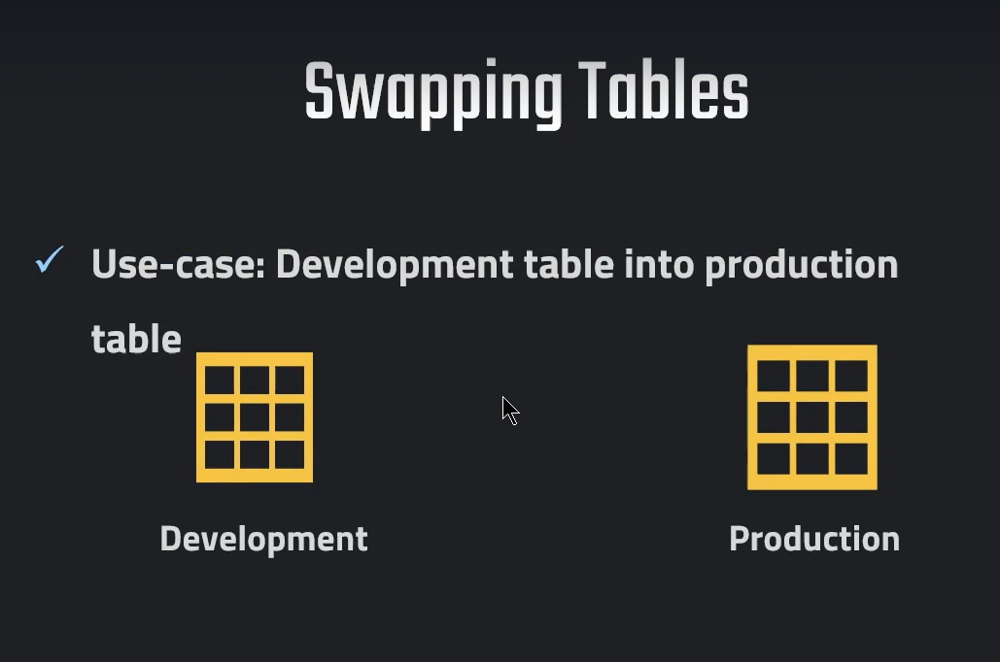
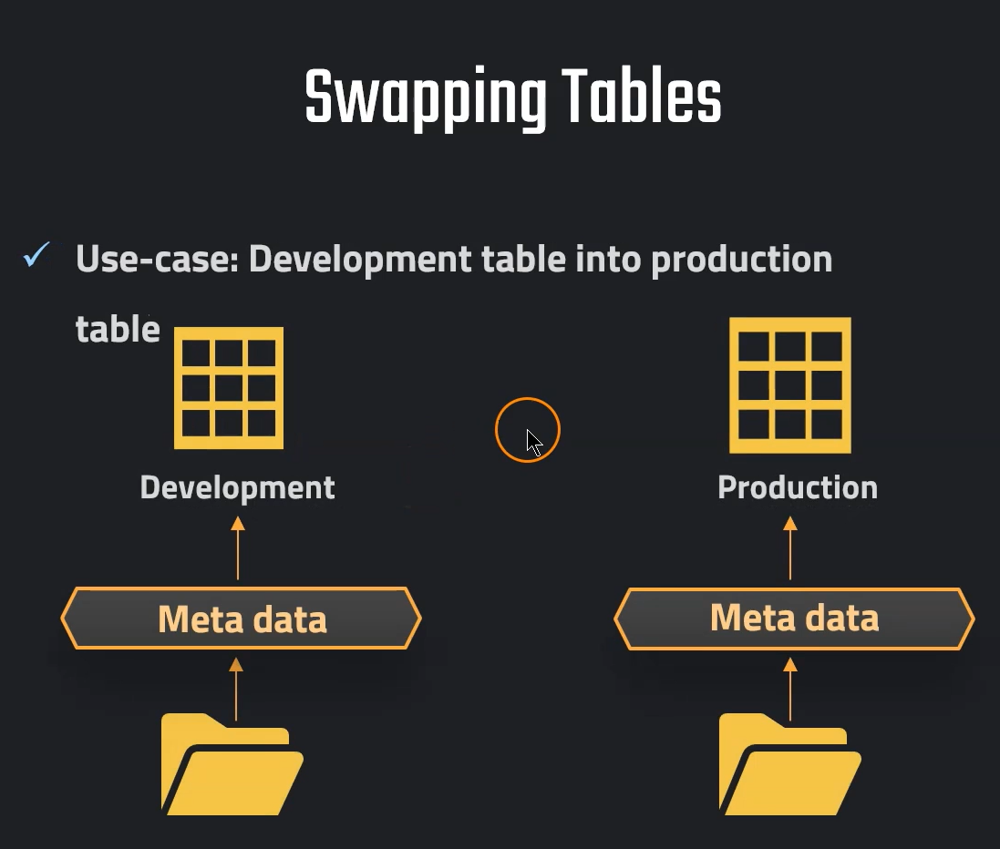
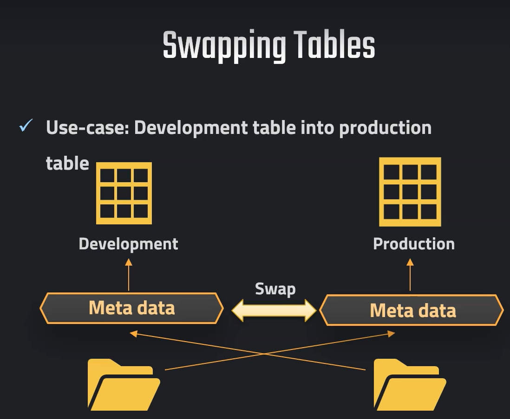
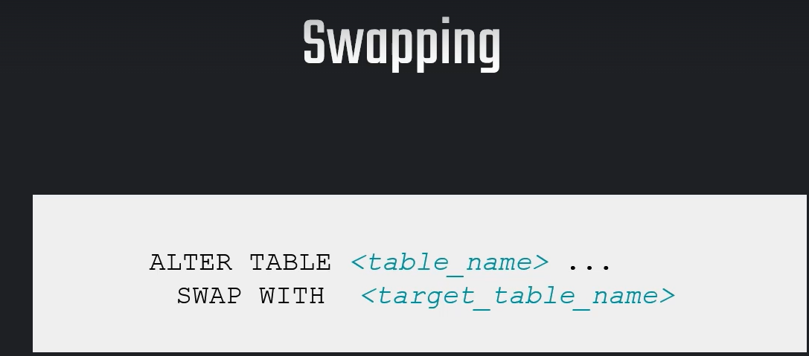
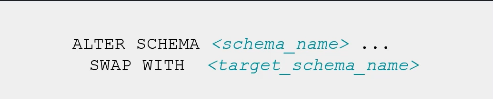
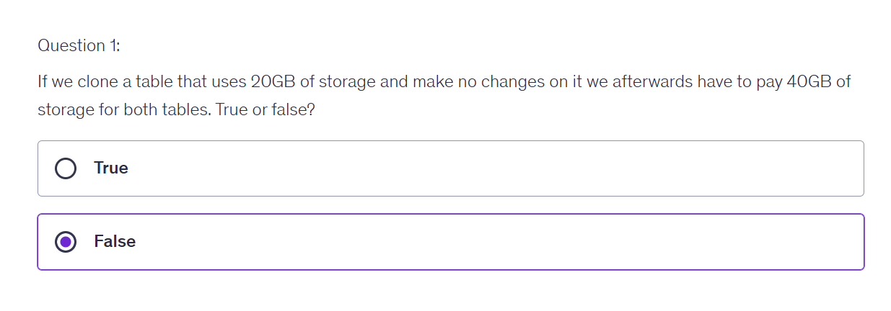
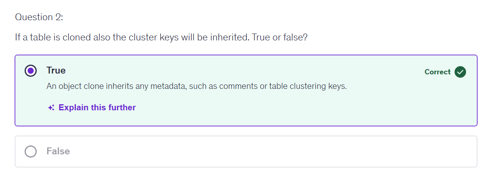
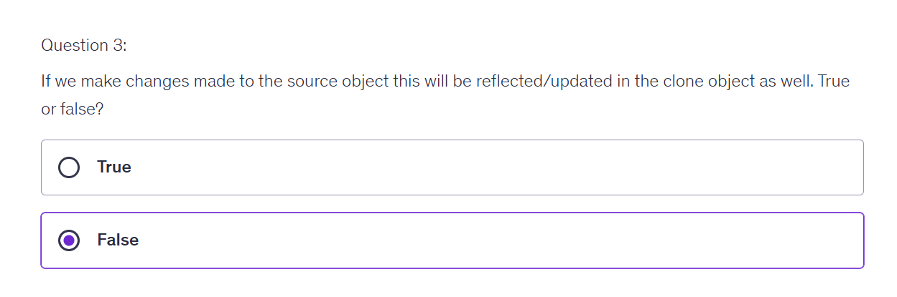
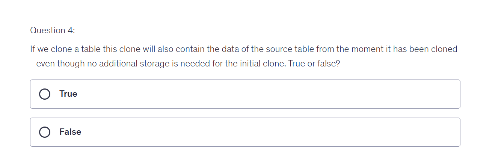

# Swapping tables











```sql


//// Swapping tables

// Setting up dev table
CREATE TRANSIENT SCHEMA OUR_FIRST_DB.COPIED_SCHEMA
CLONE OUR_FIRST_DB.PUBLIC;

SELECT * FROM OUR_FIRST_DB.COPIED_SCHEMA.CUSTOMERS  //dev table
SELECT * FROM OUR_FIRST_DB.PUBLIC.CUSTOMERS //prod table


// Modifying "Dev Table"
DELETE FROM OUR_FIRST_DB.COPIED_SCHEMA.CUSTOMERS WHERE ID < 500  --499 rows

SELECT * FROM OUR_FIRST_DB.COPIED_SCHEMA.CUSTOMERS 


// Swapping Tables
ALTER TABLE OUR_FIRST_DB.COPIED_SCHEMA.CUSTOMERS
SWAP WITH OUR_FIRST_DB.PUBLIC.CUSTOMERS

// Verifying results
SELECT * FROM OUR_FIRST_DB.COPIED_SCHEMA.CUSTOMERS --
SELECT * FROM OUR_FIRST_DB.PUBLIC.CUSTOMERS

```





